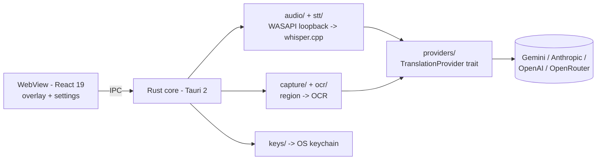

# OST - On-Screen Translator

OST is a cross-platform desktop app (Windows first) that translates what your computer is
playing and showing, in real time. It captures live system audio (the sound coming out of
your speakers), transcribes it locally with whisper.cpp, and overlays translated captions;
and it lets you select any region of the screen to OCR and translate with a live preview.
You bring your own AI keys (Gemini, Claude/Anthropic, OpenAI, OpenRouter) - stored in the
OS keychain, never in files - and the app runs quietly in the background (tray + global
hotkeys) under strict performance budgets.

| FR | Feature | Priority | Status |
|----|---------|----------|--------|
| FR-01 | Live system-audio translation (loopback -> local STT -> LLM -> caption overlay) | Must | Planned (Phase 2) |
| FR-02 | Screen-region translation with live preview (capture -> OCR -> LLM) | Must | Planned (Phase 1) |
| FR-03 | Multi-provider AI keys (keychain storage, model selection, fallback) | Must | Planned (Phase 1) |
| FR-04 | Deep interactivity (hotkeys, tray, pin/copy/history, vi+en UI) | Must | Planned (Phase 1-3) |
| FR-05 | Background operation + performance budgets | Must | Cross-cutting |

## Architecture



| Layer | Technology |
|-------|------------|
| Shell | Tauri 2 (Rust core + system WebView) |
| Frontend | React 19 + TypeScript + Vite, token-based design system |
| STT | whisper.cpp local (audio never leaves the machine) |
| OCR | ADR pending (TASK-005) |
| Providers | Gemini, Anthropic, OpenAI, OpenRouter behind one trait |
| Keys | OS keychain via keyring crate |
| CI | GitHub Actions |

Performance budgets: audio caption p95 < 3s; region translate p95 < 2s; idle < 100MB RAM,
< 1% CPU.

## Repository layout

```
src/                  React frontend (components/ui primitives, hooks, lib, i18n)  [TASK-002]
src-tauri/src/        Rust core: audio/ stt/ capture/ ocr/ providers/ keys/ shell/ commands/
docs/                 Specs, PRDs, architecture + ADRs, task board, context memory, templates
.claude/              AI-agent operating system: rules, agents, commands, hooks, settings
.github/workflows/    CI (lint + tests + build on every PR)
```

## How AI agents operate this repo

The repo runs under orchestrator-driven task control: the `orchestrator` agent decomposes
missions into task files under `docs/tasks/` (committed markdown with AI session logs),
routes them to module-owning dev agents, and enforces quality gates (tests -> code +
security review -> secret scan -> PR). Four guardrail layers protect the repo:
settings.json permission denies, PowerShell hooks (no commits to main, conventional
commits, no secret reads, immutable ADRs), behavioral rules in `.claude/rules/`, and
review commands. Full contract: [CLAUDE.md](CLAUDE.md) (other AI tools: `AGENTS.md`).

## Getting started

Prerequisites: Node 22+, Rust stable via rustup + MSVC Build Tools (TASK-001), WebView2
(preinstalled on Windows 11).

```powershell
cp .env.example .env.local   # dev/test config only - app keys go in the Settings UI
npm install                  # after TASK-002 scaffolds the app
npm run tauri dev            # run the app
cargo test                   # Rust tests (in src-tauri/)
npm run test                 # frontend tests
```

## Contributing

Branch per task (`feat/<slug>`, `fix/<slug>`, ...) - never commit to `main` directly.
Conventional Commits (see `.claude/rules/conventional-commits.md`; scopes: audio, screen,
llm, ui, core, specs, agents, infra, docs). Every PR: green CI, `/review-pr` findings
addressed, `/secret-scan` clean, task file session log updated.
