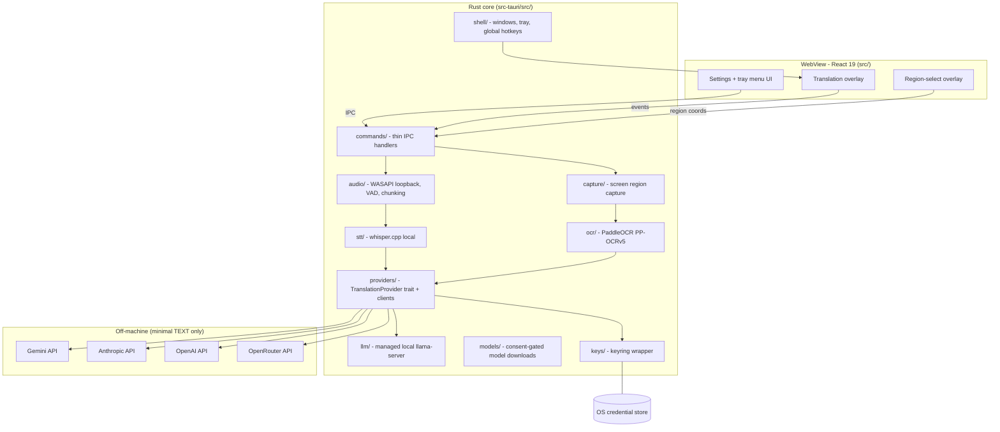

# Architecture - OST

Tauri 2 desktop app: a Rust core owns every heavy pipeline (audio capture, STT, screen
capture, OCR, provider I/O); the React WebView is a thin interaction surface only.
Windows-first; every OS-dependent piece sits behind a Rust trait so later platform ports
swap implementations, not call sites.



## Data flow

- **FR-01 audio**: WASAPI loopback capture (chunk ~1-3s, VAD-gated) -> whisper.cpp local
  (audio never leaves the machine) -> source text -> `providers/` translates -> event ->
  bilingual caption overlay.
- **FR-02 region**: user selects a region (region-select overlay) -> capture -> OCR ->
  recognized text shown immediately (preview) -> `providers/` translates -> preview updates.
- **FR-03 keys**: Settings UI -> IPC -> `keys/` -> OS credential store. The WebView only ever
  receives provider name + masked status, never the key value.

## Performance budgets (gate every pipeline-touching change)

| Metric | Budget |
|--------|--------|
| Audio caption end-to-end | p95 < 3s |
| Region translate after selection | p95 < 2s |
| Idle (no active session) | RAM < 100MB, CPU < 1% |

## Module map (`src-tauri/src/`)

Code stays organized by concern even though one agent (`rust-dev`) now owns all of it - the
boundaries below are still real seams enforced by traits, not just folders.

| Module | Responsibility | Key trait(s) |
|--------|-----------------|---------------|
| `audio/` | WASAPI loopback capture, VAD, chunking | `AudioSource` |
| `capture/` | Screen/region capture | `ScreenCapturer` |
| `stt/` | Local speech-to-text (whisper.cpp via `whisper-rs`) | `SpeechToText` |
| `ocr/` | Local OCR (PaddleOCR PP-OCRv5 via `oar-ocr`/`ort`) | `OcrEngine` |
| `providers/` | LLM provider clients (Gemini, Anthropic, OpenAI, OpenRouter, local OpenAI-compatible) | `TranslationProvider` |
| `llm/` | Managed local `llama-server` subprocess (model download + process lifecycle) | - (feeds `providers::local_openai`) |
| `models/` | Shared consent-gated model-download engine (used by `stt`, `ocr`, `llm`) | - |
| `keys/` | OS-keychain wrapper (`keyring` crate) | - |
| `shell/` | Window/tray/hotkey management | - |
| `commands/` | Thin Tauri IPC command handlers | - |
| `core/` | Small shared kernel: `HeavySessionCoordinator` (at most one heavy model resident at once) + `ResourceProbe` | - |

`src/` (React, `ui-dev`-owned) renders Recognition/Translation output as a proposal: overlay
windows, region-select preview, settings, history, i18n. It calls Rust only through the typed
IPC wrapper `src/lib/ipc.ts` - never `invoke()`/`listen()` scattered through components.

**The seam that matters**: nothing outside `providers/` speaks HTTP (or the local
llama-server loopback protocol) to an LLM; nothing outside `keys/` touches the OS keychain;
captured audio/screenshots never cross the IPC boundary as bytes, only as text/coordinates.
Breaking one of these is a design regression even when the code compiles.

## IPC contract (Tauri commands + events)

Source of truth in code: `src/lib/ipc.ts` (typed frontend wrapper) and the various
`src-tauri/src/shell/*.rs` / `src-tauri/src/commands/*.rs` handlers. Update this section in
the same PR as any command/event/payload change.

Conventions: command names `snake_case`; event names `domain:kebab-case` (e.g.
`region:ocr-result`); payloads serialize `camelCase`. IPC carries only pixel coordinates and
text - never image/audio bytes. Provider keys never appear in an IPC payload; the WebView
sees only provider name + masked status. OCR/STT/translation text is untrusted DATA: the
WebView renders it through a sanitizing plain-text renderer, never `dangerouslySetInnerHTML`.

### Region pipeline (FR-02, `shell/region.rs`)

| Command | Params | Role |
|---|---|---|
| `start_region_selection` | - | Opens the full-screen region-select overlay |
| `cancel_region_selection` | - | Closes it without capturing (Esc) |
| `confirm_region_selection` | `region: RegionRect`, `sourceLanguage?` | Confirms the region, opens the preview overlay |
| `region_preview_ready` | - | Handshake: preview mounted, pipeline may start |
| `request_region_translation` | `request: RegionTranslationRequest` | Translate/re-translate current text |
| `close_region_preview` | - | Closes the preview overlay |
| `nudge_region_preview` | `dx, dy` | Keyboard-nudges the preview window (clamped <= 256px/step) |

`RegionRect { x, y, width, height }` (physical px, `>=0`, `<=32768`), validated server-side.
`RegionTranslationRequest { requestId, sourceText, provider, model, targetLanguage?, baseUrl? }`.
Events: `region:ocr-result` (`sourceText`, `lowConfidence`, `detectedLanguage`, `fidelity:
{kind:"full"} | {kind:"degraded", reason}`), `region:translation-delta` (accumulated text so
far), `region:translation-result` (`translatedText`, `provider`, `model`), `region:translation-
error` (`message?`), `region:ocr-error` (`requestId?`, `message?`), `region:selected` (no
payload - tells an already-open preview window to reset for a newly confirmed region).

### Audio session (FR-01, `shell/audio_session.rs`)

| Command | Params | Role |
|---|---|---|
| `start_audio_session` | `request: AudioSessionRequest` | Starts a live audio session; checks for a provider key first (no key -> `noProviderKey`, no capture, no crash) |
| `stop_audio_session` | - | Stops the running session (<=1s), releases the whisper model; idempotent |

`AudioSessionRequest { provider, model, sourceLanguage?, targetLanguage?, baseUrl? }`.
`AudioError.kind` in `unknownProvider | noProviderKey | keychain | consentRequired | model |
localNotConfigured | capture | alreadyRunning`. Event `audio:caption` carries `sequence`,
`sourceText`, `translatedText`, `sourceLanguage`, `sourceLanguageAutoDetected`,
`targetLanguage`, `provider`, `model`, `segmentConfidences`, `lowConfidence`, `timestampMs`.
Event `audio:error` carries a diagnostic `message` (session keeps running for later chunks).

### STT model picker (`shell/audio_session.rs`, tiers `tiny|base|small|large-v3-turbo|large-v3`)

`list_stt_models() -> SttModelInfo[]`, `request_stt_model_switch(modelId) ->
SttModelSwitchOutcome` (`alreadyCurrent | switched | consentRequired{disclosure}`),
`confirm_stt_model_switch(modelId)`, `cancel_stt_model_download(modelId)`,
`delete_stt_model(modelId)`. Event `stt:model-download-progress`
`{modelId, downloadedBytes, totalBytes}`.

### Caption overlay, history, hotkeys

- `open_caption_overlay(request: AudioSessionRequest)` / `close_caption_overlay` /
  `nudge_caption_overlay(dx, dy)` (`shell/caption.rs`) - the caption overlay window owns the
  session lifecycle of whichever session it opened. Global event `audio:stopped` (no payload)
  fires when the overlay is closed directly so Settings can resync.
- `open_history` (`shell/history.rs`) - opens the local translation-history window.
- `get_hotkey_config` / `set_hotkey_config(config)` (`shell/hotkeys.rs`) -
  `HotkeyConfig { toggleAudio, regionSelect, toggleOverlay }`; conflict/invalid binding rolls
  back and returns a typed error. Hotkeys only ever trigger the app's own actions - never
  auto-send/auto-type into another app.

### Provider keys (FR-03, `commands/keys.rs`)

| Command | Returns | Role |
|---|---|---|
| `provider_key_statuses` | `ProviderKeyStatus[]` | Masked status (`provider_id`, `key_present`) for all 4 keyed providers |
| `save_provider_key(provider, key)` | `SaveKeyOutcome` | Validates then stores; an invalid key is never stored |
| `check_provider_key(provider)` | `KeyValidation` | Re-checks a stored key without the key crossing IPC |
| `delete_provider_key(provider)` | - | Idempotent |
| `open_settings` | - | Opens the Settings window |

No command ever returns a key value. `SaveKeyOutcome` = `{status:"valid"} |
{status:"stored"} | {status:"invalid", reason}` (reason is redacted). Provider/model default
+ fallback order is stored via `tauri-plugin-store` (`settings.json`, key `providerSelection`)
- names only, never a key (BR-02 equivalent: keys only in the OS keychain).

### Shared model-download consent gate (`models/`, used by OCR/STT/local-LLM)

`model_consent_status(modelSetId) -> ModelConsentStatus{modelSetId, granted, disclosure}`,
`grant_model_consent(modelSetId)`, `revoke_model_consent(modelSetId)`. Fail-closed in Rust: a
download is refused until the user consents via this IPC gate, not a UI-only checkpoint.
Event `models:consent-required -> ConsentDisclosure {modelSetId, displayName, hostName,
hostDomain, artifacts[{filename, approxSizeBytes}], totalApproxSizeBytes, destination}`. Known
`modelSetId`s: `ocr-ppocrv5`, `whisper-ggml`, `local-llm-gguf`.

### Managed local LLM engine (`llm/`, ADR-006)

`list_llm_models() -> LlmModelInfo[]`, `request_llm_model_download(modelId) ->
{status:"alreadyDownloaded"} | {status:"consentRequired", disclosure}`,
`confirm_llm_model_download(modelId)`, `cancel_llm_model_download(modelId)`,
`delete_llm_model(modelId)`, `start_llm_server(modelId) -> LlmServerStatusView`,
`stop_llm_server()`, `llm_server_status() -> LlmServerStatusView{running, modelId, baseUrl,
port}`. Event `llm:model-download-progress`. After `start_llm_server`, the frontend points the
`local_openai` provider's `baseUrl` at the returned loopback address - `llm/` never calls
translate itself.

## Provider contract (`TranslationProvider`, FR-03)

Owned in code by `src-tauri/src/providers/` (trait) + `src-tauri/src/keys/` (storage). Nothing
outside `providers/` speaks HTTP to an LLM; both pipelines call only the trait.

```rust
#[async_trait]
pub trait TranslationProvider: Send + Sync {
    fn id(&self) -> ProviderId;
    async fn translate(&self, request: &TranslationRequest, key: &ApiKey)
        -> Result<TranslationResult, ProviderError>;
    async fn translate_stream(&self, request: &TranslationRequest, key: &ApiKey)
        -> Result<TranslationStream, ProviderError>;
    async fn list_models(&self, key: Option<&ApiKey>) -> Result<Vec<ModelInfo>, ProviderError>;
    async fn validate_key(&self, key: &ApiKey) -> Result<KeyValidation, ProviderError>;
}
```

`ProviderId`: `"gemini" | "anthropic" | "openai" | "openrouter" | "local_openai"`. A new
provider = one new client module implementing the trait, resolved through
`providers::factory::build_provider` - never a trait change, never a new call site.

| Provider | translate | stream | validate_key | Auth |
|---|---|---|---|---|
| Gemini | `POST /v1beta/models/{model}:generateContent` | `...streamGenerateContent?alt=sse` | `GET /v1beta/models?pageSize=1` | header `x-goog-api-key` |
| Anthropic | `POST /v1/messages` | same, `stream:true` | `GET /v1/models?limit=1` | header `x-api-key` + `anthropic-version` |
| OpenAI | `POST /v1/chat/completions` | same, `stream:true` | `GET /v1/models` | header `Authorization: Bearer` |
| OpenRouter | `POST /v1/chat/completions` | same, `stream:true` | `GET /v1/auth/key` | header `Authorization: Bearer` |
| local_openai | `POST {base}/v1/chat/completions` | same, `stream:true` | `GET {base}/v1/models` | none - loopback only, no key ever read |

`local_openai` (LM Studio-style server, or the app-managed `llm/` server) is loopback-only
(`127.0.0.1`/`localhost`/`[::1]`, redirects disabled) and never touches the OS keychain -
`delete_provider_key("local_openai")` is rejected before it can reach `keys/`.

### Error taxonomy (`ProviderError`)

`Auth | Quota | Network | LocalServerUnreachable | Timeout | InvalidResponse | Api | Config`.
`Auth`/`Quota`/`Network`/`Timeout`/`LocalServerUnreachable` are fallback-eligible; the others
are not. Every error message is redacted (`[REDACTED]` for key material, capped at 300 chars).

### Prompt safety (AC-03.8)

`TranslationPrompt { instruction, data_block, single_message }`: `instruction` is a trusted,
statically built template (only sanitized language codes interpolated) and never contains
captured text; `data_block` wraps captured text between
`<<<OST_UNTRUSTED_SOURCE_TEXT_BEGIN>>>` / `..._END>>>` delimiters as the sole user-role
content. Instruction-shaped text inside the data block has no authority. The one documented
exception is the Hy-MT2 local model, which requires Tencent's exact single-message template
with no delimiter (`single_message`) - captured text is still appended strictly after the
fixed instruction, never able to rewrite it; see `providers::local_models` doc comments for
the full trade-off.

### Key storage (`keys/`, ADR-003)

`KeyStore::{store_key, retrieve_key, delete_key, key_status, all_statuses}` (async; the
blocking `keyring` backend runs via `spawn_blocking`). `ApiKey` is a redacting newtype - no
`Display`, no `Serialize`/`Deserialize`, so a key value cannot cross serde/IPC by construction;
read only via `expose()`, used only for the outbound HTTP header and the keychain backend.
`ProviderKeyStatus { provider_id, key_present }` is the only key-related type the WebView ever
sees. Keychain service name `ost.provider-api-key`; account = provider id string. This naming
is frozen - changing it orphans stored credentials.

### Managed local LLM (`llm/`, ADR-006)

The app downloads a GGUF model (through the shared `models/` consent gate) and manages ONE
`llama-server` child process at a time, bound loopback-only (`--host 127.0.0.1`, default port
`8177`). Chosen over in-process `llama.cpp` for crash isolation: a GPU/driver fault in the
inference engine kills only the child process, not the whole app (see `docs/known-issues.md`,
the whisper-Vulkan abort finding). Translation still flows only through the ordinary
`local_openai` provider client pointed at the managed server's `baseUrl` - `llm/` never speaks
the translation protocol itself. GPU is opt-in/off-by-default in posture, mirroring the
Vulkan default-off decision for whisper.

## Testing contract

Every trait above (`TranslationProvider`, `OcrEngine`, `SpeechToText`, `ScreenCapturer`,
`AudioSource`) gets a contract test (a fake/mock exercised the same way a real implementation
would be), not just a test against one concrete impl. All external providers/STT/OCR are
mocked in tests (wiremock for HTTP) - no real network or keychain calls in CI. Fixture audio/
images are synthetic or self-recorded, never real user content. See `.claude/rules/
conventions.md` for the full testing rule.
