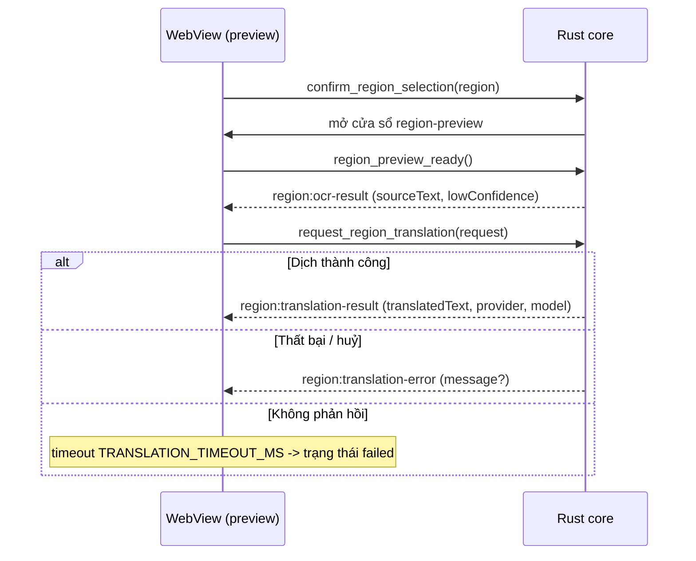

# Hợp đồng IPC - OST

Hợp đồng Tauri IPC (commands + events) giữa WebView (React) và Rust core. Tài liệu này là
nguồn tham chiếu chung; nó phải luôn khớp với hai file mã nguồn:

- `src/lib/ipc.ts` - wrapper IPC có kiểu ở phía frontend (mọi lời gọi frontend -> core đi qua
  đây, không import `invoke`/`listen` trực tiếp trong component/hook).
- `src-tauri/src/shell/region.rs` - các command handler + tên event vùng chọn ở phía core.
- `src-tauri/src/models/mod.rs` - các lệnh đồng thuận tải-model dùng chung (facility chung).

Khi thay đổi bất kỳ command, event hay payload nào: cập nhật cả ba nơi TRONG CÙNG một PR
(docs-workflow.md).

## Nguyên tắc chung

- Tên command dùng `snake_case`; tên event dùng namespace `domain:kebab-case`
  (ví dụ `region:ocr-result`).
- Payload tuần tự hoá sang `camelCase` (Rust `#[serde(rename_all = "camelCase")]`) để khớp
  với kiểu TypeScript.
- IPC chỉ mang toạ độ pixel và text; **không bao giờ** truyền byte ảnh/âm thanh qua ranh giới
  IPC (security-privacy.md). Ảnh chụp vùng nằm lại trong Rust core.
- Khoá provider **không bao giờ** xuất hiện trong payload IPC; WebView chỉ nhận tên provider +
  trạng thái đã che (agent-guardrails.md muc 3).
- Text từ OCR/dịch là **DATA không tin cậy**: WebView render bằng renderer plain-text (không
  `dangerouslySetInnerHTML`, không diễn giải markup) - human-in-the-loop.md, design-system.md.

## Kiểu dữ liệu dùng chung

### `RegionRect`

Hình chữ nhật vùng chọn theo pixel vật lý, gốc toạ độ là màn hình chính.

| Trường   | Kiểu     | Ghi chú                                  |
| -------- | -------- | ---------------------------------------- |
| `x`      | `number` | Toạ độ trái (px vật lý), `>= 0`.         |
| `y`      | `number` | Toạ độ trên (px vật lý), `>= 0`.         |
| `width`  | `number` | Chiều rộng, `> 0`, `<= 32768`.           |
| `height` | `number` | Chiều cao, `> 0`, `<= 32768`.            |

Core kiểm tra hợp lệ (`validate_region`); vùng rỗng hoặc vượt ngưỡng bị từ chối với lỗi
`invalid region`.

### `RegionTranslationRequest`

Yêu cầu dịch (lần đầu và khi dịch lại, AC-02.8).

| Trường       | Kiểu     | Ghi chú                                             |
| ------------ | -------- | --------------------------------------------------- |
| `requestId`  | `string` | Id do UI sinh (`ui-<n>`) để đối chiếu phản hồi.     |
| `sourceText` | `string` | Text nguồn từ OCR; không được rỗng.                 |
| `provider`   | `string` | Provider được chọn (gemini/anthropic/openai/...).   |
| `model`      | `string` | Model được chọn.                                    |

### `SourceLanguage` (ngôn ngữ nguồn do người dùng chọn)

Chuỗi ngôn ngữ nguồn theo BR-07 (tự phát hiện CỘNG ghim thủ công). Đi kèm lệnh
`confirm_region_selection` (tham số `sourceLanguage`).

| Giá trị            | Ý nghĩa                                                                 |
| ------------------ | ---------------------------------------------------------------------- |
| `"auto"` / rỗng    | Không ghim: tự phát hiện chỉ là GỢI Ý; KHÔNG khẳng định `degraded`.     |
| mã ISO 639-1       | Ghim thủ công (ví dụ `vi`, `ja`, `ko`, `en`, `zh`); chuẩn hoá lowercase. |

QUAN TRỌNG (sửa lỗi S1): tuyên bố `fidelity` và định tuyến rec-model theo ngôn ngữ
được CHỌN này, KHÔNG bao giờ theo ngôn ngữ phát hiện SAU OCR. PP-OCRv5 latin rec
rơi mất dấu thanh tiếng Việt (U+1E00-U+1EFF) nên các dấu này VẮNG khỏi output OCR;
phát hiện từ output sẽ nhầm `vi` thành `en` (Full) và thông báo Degraded bắt buộc
không bao giờ hiện. Định tuyến: `vi` + latin khác -> latin rec; `ja`/`zh`/`en` ->
main rec; `ko` -> korean rec; `auto` -> main (mặc định best-effort).

## Commands (frontend -> core)

Tất cả do `src-tauri/src/shell/region.rs` sở hữu; trả về `Result<(), ShellError>` (chuỗi lỗi
tuần tự hoá, không chứa nội dung người dùng hay bí mật).

| Command                     | Tham số                             | Vai trò                                                                 |
| --------------------------- | ----------------------------------- | ----------------------------------------------------------------------- |
| `start_region_selection`    | -                                   | Mở overlay chọn vùng toàn màn hình (AC-02.1).                           |
| `cancel_region_selection`   | -                                   | Đóng overlay chọn vùng, KHÔNG phát sự kiện chụp (đường Esc, AC-02.1).   |
| `confirm_region_selection`  | `region: RegionRect`, `sourceLanguage?: string` | Xác nhận vùng chọn (kèm ngôn ngữ nguồn, xem `SourceLanguage`), đóng overlay chọn, mở overlay preview. |
| `region_preview_ready`      | -                                   | Handshake: preview đã mount và lắng nghe; pipeline có thể bắt đầu phát. |
| `request_region_translation`| `request: RegionTranslationRequest` | Yêu cầu dịch/dịch lại text hiện tại (AC-02.8).                          |
| `set_region_live_update`    | `enabled: boolean`                  | Bật/tắt cập nhật trực tiếp vùng đã chọn (AC-02.4, nửa UI).              |
| `close_region_preview`      | -                                   | Đóng overlay preview.                                                    |
| `nudge_region_preview`      | `dx: number, dy: number`            | Dời overlay preview bằng bàn phím (AC-04.3); mỗi bước bị kẹp `<= 256`.  |

## Commands phiên âm thanh trực tiếp (FR-01)

Do `src-tauri/src/shell/audio_session.rs` sở hữu; trả về `Result<(), AudioError>` (lỗi tuần
tự hoá thành `{ kind }`, không chứa nội dung âm thanh/khoá). Pipeline chạy HOÀN TOÀN ngoài
luồng UI: chụp WASAPI + VAD + chunk trên luồng riêng, whisper suy luận trên `spawn_blocking`,
dịch qua lớp provider, rồi phát sự kiện `audio:caption`. Âm thanh KHÔNG BAO GIỜ rời máy
(STT cục bộ) - chỉ TEXT phiên âm + bản dịch đi tới provider (security-privacy.md, AC-01.6).

| Command               | Tham số                     | Vai trò                                                                                     |
| --------------------- | --------------------------- | ------------------------------------------------------------------------------------------ |
| `start_audio_session` | `request: AudioSessionRequest` | Bắt đầu phiên dịch âm thanh (AC-01.1). Kiểm tra khoá provider TRƯỚC (AC-01.11: không có khoá -> lỗi `noProviderKey` hướng người dùng tới Settings, không chụp, không crash), bảo đảm model whisper đã tải + verify SHA-256 qua cổng đồng thuận fail-closed, rồi spawn chụp + vòng lặp caption. |
| `stop_audio_session`  | -                           | Dừng phiên đang chạy (AC-01.10): chụp dừng trong <= 1s và model whisper được giải phóng. Idempotent. |

### `AudioSessionRequest`

| Trường           | Kiểu               | Ghi chú                                                                 |
| ---------------- | ------------------ | ---------------------------------------------------------------------- |
| `provider`       | `string`           | Provider được chọn (gemini/anthropic/openai/openrouter).               |
| `model`          | `string`           | Model được chọn.                                                       |
| `sourceLanguage` | `string \| null`   | Ghim ngôn ngữ nguồn (AC-01.4); rỗng/`"auto"`/absent = tự phát hiện (AC-01.3). |
| `targetLanguage` | `string \| null`   | Ngôn ngữ đích (AC-01.5); rỗng/absent = mặc định `vi`.                  |

`AudioError` tuần tự hoá thành `{ kind }` với `kind` ∈ `unknownProvider | noProviderKey |
keychain | consentRequired | model | capture | alreadyRunning`; UI ánh xạ `kind` sang thông
báo i18n (với `noProviderKey` là CTA mở Settings), không render chuỗi backend thô.

Model whisper dùng lại cổng đồng thuận tải-model dùng chung với `modelSetId` = `"whisper-ggml"`
(xem mục dưới). Khi chưa có đồng thuận, `start_audio_session` phát `models:consent-required`
(kèm `ConsentDisclosure`) rồi trả lỗi `consentRequired`; sau khi người dùng `grant_model_consent`,
UI gọi lại `start_audio_session`.

### Commands bộ chọn model whisper (FR-01, TASK-026)

Do `src-tauri/src/shell/audio_session.rs` sở hữu (cùng module với phiên âm thanh); mở rộng
luồng đồng thuận-tải BR-08 từ "chỉ lần chạy đầu" sang "bất kỳ lúc nào trong Settings"
(PRD-FR-01-stt-backend-options mục 4, FR-01.STT-3). Danh mục tier: `tiny` / `base` (mặc định)
/ `small` / `large-v3-turbo` / `large-v3` (chỉ khả dụng khi hardware probe phát hiện GPU CUDA
tương thích - `large-v3` cũng đòi RAM sàn như `large-v3-turbo`); `medium` không có trong danh
mục này. Model đang dùng được lưu tại `settings.json` khoá `sttModel` (CHỈ id, không phải file
hay đường dẫn).

| Command                     | Tham số            | Trả về                    | Vai trò                                                                                     |
| ---------------------------- | ------------------ | -------------------------- | -------------------------------------------------------------------------------------------- |
| `list_stt_models`            | -                  | `SttModelInfo[]`           | Liệt kê 5 tier với dung lượng/RAM ước tính, đã tải chưa, có được phần cứng hiện tại cho phép không, có phải model đang dùng không. |
| `request_stt_model_switch`   | `modelId: string`  | `SttModelSwitchOutcome`    | Kiểm tra id/phần cứng/phiên đang chạy; nếu model đã có sẵn trên đĩa thì áp dụng NGAY (lưu + đổi); nếu chưa có thì trả `consentRequired` kèm dung lượng CHÍNH XÁC của tier đó (không tải). |
| `confirm_stt_model_switch`  | `modelId: string`  | `void`                     | Gọi sau khi người dùng xác nhận `consentRequired`: cấp đồng thuận (cùng cờ `whisper-ggml`, idempotent), tải kèm tiến độ (`stt:model-download-progress`), rồi lưu + đổi model đang dùng. |

Lỗi tuần tự hoá thành `{ kind }` với `kind` ∈ `unknownModel | notAllowed | sessionActive |
download | store`; `sessionActive` xuất hiện khi một phiên âm thanh đang chạy - đổi model bị
từ chối cho tới khi phiên dừng (không đổi engine dưới một vòng lặp phiên âm đang chạy).

#### `SttModelInfo`

```ts
type SttModelInfo = {
  id: string; // "tiny" | "base" | "small" | "large-v3-turbo" | "large-v3"
  label: string;
  approxDownloadBytes: number;
  approxRamBytes: number;
  downloaded: boolean;
  allowedByProbe: boolean; // false = ẩn/disable kèm lý do (sàn RAM hoặc thiếu CUDA)
  requiresCuda: boolean; // true chỉ với "large-v3"
  current: boolean;
};
```

#### `SttModelSwitchOutcome` (union gắn thẻ theo `status`)

```ts
type SttModelSwitchOutcome =
  | { status: "alreadyCurrent" }
  | { status: "switched" }
  | { status: "consentRequired"; disclosure: ConsentDisclosure };
```

`disclosure` dùng lại kiểu `ConsentDisclosure` chung (xem dưới) nhưng CHỈ liệt kê MỘT artifact
- đúng file của tier được chọn, không phải toàn bộ danh mục - để dung lượng disclosure trung
thực với đúng một lần tải.

#### `stt:model-download-progress` -> `SttModelDownloadProgressPayload`

Phát lặp lại trong lúc `confirm_stt_model_switch` đang tải, để Settings hiển thị thanh tiến độ
thay vì treo im lặng trong lúc tải file vài trăm MB - vài GB (human-in-the-loop.md).

| Trường            | Kiểu     | Ghi chú                                   |
| ----------------- | -------- | ------------------------------------------ |
| `modelId`         | `string` | Id tier đang tải.                          |
| `downloadedBytes` | `number` | Số byte đã tải.                            |
| `totalBytes`      | `number` | Tổng số byte (từ header hoặc ước tính khi thiếu). |

### Commands cửa sổ overlay caption (FR-01, TASK-016)

Do `src-tauri/src/shell/caption.rs` sở hữu; wrapper TypeScript là `captionIpc` trong `ipc.ts`.
Cửa sổ overlay caption là cửa sổ always-on-top/transparent/không viền riêng (nhãn
`caption-overlay`), phản chiếu cửa sổ preview vùng chọn. Nó SỞ HỮU vòng đời phiên nó được mở:
tự gọi `start_audio_session` khi mount, tái phát tín hiệu sau khi cấp đồng thuận, và
`stop_audio_session` khi đóng. Yêu cầu phiên đi kèm dưới dạng query param CHỈ TÊN
(provider/model + mã ngôn ngữ) - KHÔNG BAO GIỜ khoá hay âm thanh.

| Command                 | Tham số                        | Vai trò                                                         |
| ----------------------- | ------------------------------ | -------------------------------------------------------------- |
| `open_caption_overlay`  | `request: AudioSessionRequest` | Mở (hoặc focus) cửa sổ overlay caption cho phiên, truyền TÊN qua query. |
| `close_caption_overlay` | -                              | Đóng cửa sổ overlay caption. Idempotent.                       |
| `nudge_caption_overlay` | `dx: number, dy: number`       | Dời overlay caption bằng bàn phím (AC-04.3); dùng lại kẹp `clamp_nudge` của vùng chọn. |

Khi cửa sổ overlay caption bị HUỶ (đóng trực tiếp, hoặc qua tray/hotkey), core phát
`audio:stopped` (toàn cục, không payload) để một cửa sổ Settings riêng đồng bộ lại trạng
thái đang-chạy (TASK-016 follow-up). Hằng số: `EVENT_AUDIO_STOPPED` (`audio_session.rs`) /
`EVENT_AUDIO_STOPPED` (`ipc.ts`).

## Commands cửa sổ Lịch sử (FR-04, BR-06)

Do `src-tauri/src/shell/history.rs` sở hữu; wrapper TypeScript là `historyIpc` trong
`ipc.ts`. Cửa sổ Lịch sử là cửa sổ thường (nhãn `history`) tải `index.html?view=history`,
liệt kê các lượt dịch đã lưu cục bộ (chỉ text). Mở được từ tray ("Lịch sử") hoặc Settings.

| Command        | Tham số | Vai trò                                                        |
| -------------- | ------- | -------------------------------------------------------------- |
| `open_history` | -       | Mở (hoặc show + focus) cửa sổ Lịch sử. Single instance.        |

## Commands phím tắt toàn cục (FR-04, AC-04.1)

Do `src-tauri/src/shell/hotkeys.rs` sở hữu; wrapper TypeScript là `hotkeysIpc` trong
`ipc.ts`. Rust SỞ HỮU việc đăng ký với OS (`tauri-plugin-global-shortcut`) và lưu trữ; UI
chỉ đọc cấu hình hiệu lực và gửi cấu hình mới. Cấu hình lưu bằng `tauri-plugin-store`
(`settings.json`, khoá `hotkeys` - CHỈ TÊN, chuỗi accelerator, không bao giờ bí mật).

| Command             | Tham số                  | Trả về                          | Vai trò                                                                 |
| ------------------- | ------------------------ | ------------------------------- | ---------------------------------------------------------------------- |
| `get_hotkey_config` | -                        | `HotkeyConfig`                  | Cấu hình phím tắt hiệu lực hiện tại.                                    |
| `set_hotkey_config` | `config: HotkeyConfig`   | `HotkeyConfig`                  | Kiểm tra, đăng ký lại với OS, lưu, rồi trả cấu hình mới. Xung đột đăng ký -> rollback về bộ cũ và trả lỗi có kiểu. |

```ts
type HotkeyAction = "toggleAudio" | "regionSelect" | "toggleOverlay";

type HotkeyConfig = {
  toggleAudio: string; // ví dụ "Ctrl+Alt+A"
  regionSelect: string; // ví dụ "Ctrl+Alt+R"
  toggleOverlay: string; // ví dụ "Ctrl+Alt+O"
};
```

`set_hotkey_config` lỗi tuần tự hoá thành `{ kind, action }` với `kind` ∈ `invalidBinding |
duplicate | conflict | store`; `action` (`HotkeyAction` hoặc `null`) chỉ ra binding gây lỗi.
UI ánh xạ `kind` sang thông báo i18n, không render chuỗi backend thô. Phím tắt CHỈ kích hoạt
hành động của chính ứng dụng (start/stop phiên âm thanh, chọn vùng, hiện/ẩn overlay) - không
bao giờ tự gửi/gõ bản dịch ra ngoài (human-in-the-loop.md).

## Commands quản lý khoá provider (FR-03)

Do `src-tauri/src/commands/keys.rs` sở hữu; wrapper TypeScript là `keysIpc` trong `ipc.ts`.
Bất biến bảo mật (BR-02, NFR-SEC-01, AC-03.2/03.3): WebView gửi giá trị key XUỐNG đúng một
lần khi nhập, KHÔNG BAO GIỜ nhận lại key; mọi kiểu trả về chỉ là trạng thái masked, phán
quyết kiểm tra, hoặc lỗi có kiểu. Không command nào trả về `ApiKey` hay chuỗi key. Cửa sổ
Settings mở qua `open_settings` (`src-tauri/src/shell/settings.rs`).

| Command                 | Tham số                        | Trả về                        | Vai trò                                                                     |
| ----------------------- | ------------------------------ | ----------------------------- | -------------------------------------------------------------------------- |
| `provider_key_statuses` | -                              | `ProviderKeyStatus[]`         | Trạng thái masked (tên provider + `key_present`) cho cả 4 provider (AC-03.1/03.3). |
| `save_provider_key`     | `provider: string, key: string`| `SaveKeyOutcome`              | Kiểm tra (một lệnh gọi tối thiểu, AC-03.4) rồi lưu vào keychain (AC-03.2). Key sai KHÔNG được lưu. |
| `check_provider_key`    | `provider: string`             | `KeyValidation`               | Kiểm tra lại key đã lưu (đọc từ keychain trong core, key không qua IPC) - AC-03.4. |
| `delete_provider_key`   | `provider: string`             | `void`                        | Xoá key khỏi keychain (AC-03.7). Idempotent.                               |
| `open_settings`         | -                              | `void`                        | Mở cửa sổ Settings.                                                         |

Kiểu dữ liệu:

- `ProviderKeyStatus` = `{ provider_id: "gemini"|"anthropic"|"openai"|"openrouter", key_present: boolean }`
  (serde snake_case, khớp `keys/store.rs`). Đây là kiểu DUY NHẤT liên quan tới key mà WebView
  được nhận.
- `SaveKeyOutcome` = `{ status: "valid" } | { status: "stored" } | { status: "invalid", reason }`.
  Cả 4 provider đều đã có client (TASK-010) nên save/check luôn chạy kiểm tra key trực tiếp -
  `stored` giờ chỉ là nhánh dự phòng (no-client) còn lại ở lớp lệnh cho mục đích test.
  `reason` là chuỗi đã redact, không chứa key - UI hiển thị thông báo i18n của chính nó.
- `KeyValidation` = `{ status: "valid" } | { status: "invalid", reason }`.
- Lỗi command tuần tự hoá thành `{ kind }` với `kind` ∈ `unknownProvider | invalidInput |
  notConfigured | network | quota | timeout | config | keychain | provider`; UI ánh xạ `kind`
  sang thông báo i18n, không bao giờ render chuỗi backend thô.

## Lưu cấu hình lựa chọn provider (FR-03)

Lựa chọn provider/model mặc định + thứ tự fallback được lưu bằng `tauri-plugin-store`
(`settings.json`, khoá `providerSelection`) qua `src/lib/settings.ts`. CHỈ lưu TÊN
(provider id, model id, thứ tự) - KHÔNG BAO GIỜ lưu key (BR-02).

### Lệnh đồng thuận tải model (dùng chung - `src-tauri/src/models/`)

Cơ chế đồng thuận tải-model lần đầu là FACILITY DÙNG CHUNG (OCR là consumer đầu
tiên; whisper STT tái sử dụng ở Phase 2). FAIL-CLOSED TRONG RUST: việc tải model bị
TỪ CHỐI cho tới khi người dùng đồng thuận qua lệnh IPC - không phải cổng chỉ-ở-UI
(security-privacy.md, agent-guardrails.md 5). Cờ đồng thuận được LƯU (tauri-plugin-store,
chỉ cờ/tên, không bao giờ bí mật) và CÓ THỂ THU HỒI.

| Command                 | Tham số                 | Vai trò                                                                          |
| ----------------------- | ----------------------- | ------------------------------------------------------------------------------- |
| `model_consent_status`  | `modelSetId: string`    | Trả `ModelConsentStatus` (cờ `granted` + `disclosure` để UI hiển thị trước khi hỏi). |
| `grant_model_consent`   | `modelSetId: string`    | Cấp đồng thuận tải model (mở cổng fail-closed). Idempotent.                     |
| `revoke_model_consent`  | `modelSetId: string`    | Thu hồi đồng thuận (Settings). Lần tải kế tiếp lại fail-closed.                 |

`modelSetId` hiện dùng của OCR là `"ocr-ppocrv5"` (det + main/latin/korean rec + dict).
STT whisper (FR-01, TASK-014) đăng ký thêm `modelSetId` = `"whisper-ggml"` vào cùng cổng
này (host Hugging Face, artifact là model `ggml-*.bin` được HW-probe khuyến nghị theo BR-08);
KHÔNG có lệnh IPC mới - UI dùng lại 3 lệnh trên với id `"whisper-ggml"`.

#### `ModelConsentStatus` / `ConsentDisclosure`

```ts
type ModelConsentStatus = {
  modelSetId: string;
  granted: boolean;
  disclosure: ConsentDisclosure;
};

type ConsentDisclosure = {
  modelSetId: string;
  displayName: string;
  hostName: string;    // "ModelScope"
  hostDomain: string;  // "modelscope.cn" - nêu rõ host, không che giấu
  artifacts: { filename: string; approxSizeBytes: number }[];
  totalApproxSizeBytes: number;
  destination: string; // thư mục cache trên đĩa (OAR_HOME, mặc định ~/.oar)
};
```

`disclosure` nêu RÕ host tải (ModelScope, modelscope.cn), kích thước từng artifact
và tổng, cùng đường dẫn đích - để người dùng quyết định có hiểu biết (đây là luồng
egress, security-reviewer soát). Tải qua HTTPS; oar-ocr `auto-download` xác minh
SHA-256 nội bộ. Coi mọi chuỗi là DATA (render plain-text).

## Events (core -> WebView)

Phát tới cửa sổ `region-preview` bằng `emit_to`. Tên hằng số nằm ở `region.rs`
(`EVENT_OCR_RESULT`, `EVENT_TRANSLATION_RESULT`, `EVENT_TRANSLATION_ERROR`) và ở `ipc.ts`
(`EVENT_REGION_OCR_RESULT`, `EVENT_REGION_TRANSLATION_RESULT`,
`EVENT_REGION_TRANSLATION_ERROR`).

### `region:ocr-result` -> `OcrResultPayload`

Phát khi OCR hoàn tất cho vùng đã chụp.

| Trường             | Kiểu               | Ghi chú                                                        |
| ------------------ | ------------------ | ------------------------------------------------------------- |
| `requestId`        | `string`           | Id tương quan (lõi sinh, dạng `region-ocr-<n>`).             |
| `sourceText`       | `string`           | Text nhận dạng được; rỗng/khoảng trắng nghĩa là không có text (AC-02.7). |
| `lowConfidence`    | `boolean`          | Cờ độ tin cậy thấp do pipeline tính (AC-02.6, BR-05); UI render nguyên trạng, không áp ngưỡng riêng. |
| `detectedLanguage` | `string \| null`   | Ngôn ngữ nguồn phát hiện được (tuỳ chọn).                     |
| `fidelity`         | `OcrFidelity`      | Tuyên bố độ trung thực nhận dạng cho ngôn ngữ nguồn đã phát hiện (bắt buộc, human-in-the-loop.md). Xem bên dưới. |

#### `OcrFidelity` (union gắn thẻ theo `kind`)

Union gắn thẻ, bắt buộc trên mọi `region:ocr-result`:

```ts
type OcrFidelity =
  | { kind: "full" }
  | { kind: "degraded"; reason: string };
```

- `full`: bộ ký tự của engine phủ đủ ngôn ngữ nguồn.
- `degraded`: engine nhận dạng được ngôn ngữ nhưng THIẾU một lớp ký tự; `reason`
  nêu tên bộ ký tự thiếu (plain text, coi là DATA, render không diễn giải markup).
  Với engine PaddleOCR PP-OCRv5 mặc định (ADR-004), tiếng Việt (`vi`) là
  `degraded`: các dấu thanh tổ hợp (Latin Extended Additional, U+1E00-U+1EFF)
  không có trong từ điển latin rec, nên bị rơi dù độ tin cậy theo dòng vẫn cao -
  vì vậy `lowConfidence` KHÔNG bắt được trường hợp này và cần tuyên bố riêng.
  UI phải hiển thị một thông báo cố định khi `degraded` (không đoán im lặng,
  human-in-the-loop.md). Các ngôn ngữ en/ja/ko/zh là `full`.

Ghi chú đồng bộ hằng số (docs-workflow.md): trường `fidelity` thuộc
`OcrResultPayload` phía Rust (`OcrFidelityPayload`, serde `#[serde(tag = "kind")]`
lowercase) và sẽ được `src/lib/ipc.ts` phản chiếu khi frontend tiêu thụ (task UI
riêng; PR này chỉ chốt hợp đồng, KHÔNG sửa `src/lib/ipc.ts`).

### `region:translation-result` -> `TranslationResultPayload`

Phát khi provider dịch xong.

| Trường           | Kiểu     | Ghi chú                                                    |
| ---------------- | -------- | --------------------------------------------------------- |
| `requestId`      | `string` | Phải khớp yêu cầu đang chờ; phản hồi lạc bị bỏ qua.       |
| `translatedText` | `string` | Bản dịch (render plain-text).                             |
| `provider`       | `string` | Provider thực sự đã dịch (AC-03.5, badge minh bạch).      |
| `model`          | `string` | Model thực sự đã dịch.                                    |

### `region:translation-error` -> `TranslationErrorPayload`

Phát khi yêu cầu dịch thất bại (lỗi provider, lỗi mạng, huỷ). Đưa preview ra khỏi trạng thái
"đang dịch" để UI không treo im lặng (human-in-the-loop.md, BR-05).

| Trường      | Kiểu               | Ghi chú                                                                                  |
| ----------- | ------------------ | --------------------------------------------------------------------------------------- |
| `requestId` | `string`           | Phải khớp yêu cầu đang chờ; lỗi lạc bị bỏ qua.                                          |
| `message`   | `string \| null`   | Chuỗi chẩn đoán tuỳ chọn, coi là DATA không tin cậy; UI hiển thị thông báo lỗi i18n của chính nó, không render chuỗi thô. |

Nếu không có sự kiện nào tới, UI tự chuyển sang trạng thái thất bại sau ngưỡng timeout
(`TRANSLATION_TIMEOUT_MS`, hiện 8000 ms) - dư dả so với NFR-PERF-02 (region p95 < 2s) nhưng
vẫn bảo đảm không treo vô hạn.

### `region:ocr-error` -> `OcrErrorPayload`

Phát khi CHỤP hoặc OCR thất bại (không phải lỗi thiếu đồng thuận - trường hợp đó dùng
`models:consent-required` bên dưới). Đưa preview ra khỏi trạng thái "đang nhận dạng" để
UI không treo im lặng (human-in-the-loop.md: không thất bại im lặng). Hằng số:
`EVENT_OCR_ERROR` (`region.rs`).

Các NGƯỠNG THỜI GIAN (TASK-021) cũng ánh xạ về sự kiện này thay vì treo vô hạn: chụp màn
hình chạy trên luồng worker đã khởi tạo COM với timeout giới hạn (~5s -> `CaptureError::Backend`),
và lần đầu tải model PP-OCRv5 từ ModelScope có timeout giới hạn (~180s -> `OcrError::ModelLoad`).
Cả hai đều là lỗi đầu cuối (terminal), không phải yêu cầu đồng thuận.

| Trường      | Kiểu               | Ghi chú                                                                                  |
| ----------- | ------------------ | --------------------------------------------------------------------------------------- |
| `requestId` | `string \| null`   | Id tương quan lõi sinh (`region-ocr-<n>`) nếu có.                                        |
| `message`   | `string \| null`   | Chuỗi chẩn đoán tuỳ chọn, coi là DATA không tin cậy (không có pixel/khoá/nội dung người dùng); UI hiển thị thông báo i18n của chính nó, không render chuỗi thô. |

### `models:consent-required` -> `ConsentDisclosure`

Phát khi OCR bị chặn vì chưa có đồng thuận tải model lần đầu (fail-closed). Mang
`ConsentDisclosure` (xem trên) để UI mở hộp thoại đồng thuận nêu host/kích thước/đích.
Namespace `models:` vì dùng chung (whisper STT tái dùng ở Phase 2). Hằng số:
`EVENT_MODEL_CONSENT_REQUIRED` (`region.rs`). Sau khi người dùng gọi `grant_model_consent`,
UI kích hoạt lại luồng preview (`region_preview_ready`) để chạy OCR.

### `audio:caption` -> `AudioCaptionPayload`

Phát MỘT lần cho mỗi chunk lời nói đã dịch (FR-01). Overlay caption (TASK-016) render. Phát
toàn cục (`app.emit`) để cửa sổ caption nhận bất kể nhãn. Hằng số: `EVENT_AUDIO_CAPTION`
(`audio_session.rs`). Mọi text là DATA không tin cậy (render plain-text, không diễn giải
markup - human-in-the-loop.md, design-system.md).

| Trường                       | Kiểu       | Ghi chú                                                                 |
| ---------------------------- | ---------- | ---------------------------------------------------------------------- |
| `sequence`                   | `number`   | Chỉ số chunk đơn điệu trong phiên (từ bộ chunk chụp).                  |
| `sourceText`                 | `string`   | Text phiên âm (nguồn).                                                 |
| `translatedText`             | `string`   | Bản dịch (plain text).                                                 |
| `sourceLanguage`             | `string`   | Ngôn ngữ nguồn phát hiện được hoặc đã ghim (AC-01.3/AC-01.4).          |
| `sourceLanguageAutoDetected` | `boolean`  | `true` khi whisper tự phát hiện; `false` khi người dùng ghim.          |
| `targetLanguage`             | `string`   | Ngôn ngữ đích của bản dịch (AC-01.5).                                  |
| `provider`                   | `string`   | Provider thực sự đã dịch (AC-03.5, badge minh bạch).                   |
| `model`                      | `string`   | Model thực sự đã dịch.                                                 |
| `segmentConfidences`         | `number[]` | Độ tin cậy trung bình theo token của từng segment, theo thứ tự.       |
| `lowConfidence`              | `boolean`  | `true` khi CÓ segment dưới ngưỡng (AC-01.7/BR-05); overlay gắn cờ không chắc chắn. |
| `timestampMs`                | `number`   | Mili-giây kể từ khi phiên bắt đầu (đơn điệu; không phải wall-clock).   |

### `audio:error` -> `AudioErrorPayload`

Phát khi một chunk thất bại khi phiên âm hoặc dịch (không phải lỗi thiếu đồng thuận - trường
hợp đó dùng `models:consent-required`). Phiên VẪN chạy cho các chunk sau; đây là tín hiệu để
overlay không treo im lặng (human-in-the-loop.md). Hằng số: `EVENT_AUDIO_ERROR`.

| Trường    | Kiểu     | Ghi chú                                                                                       |
| --------- | -------- | -------------------------------------------------------------------------------------------- |
| `message` | `string` | Chuỗi chẩn đoán, coi là DATA không tin cậy (không chứa âm thanh/khoá); UI hiển thị i18n riêng. |

## Trình tự vòng đời preview (SCR-03)



OCR rỗng (AC-02.7): UI vào trạng thái `empty` và KHÔNG gửi `request_region_translation`.
