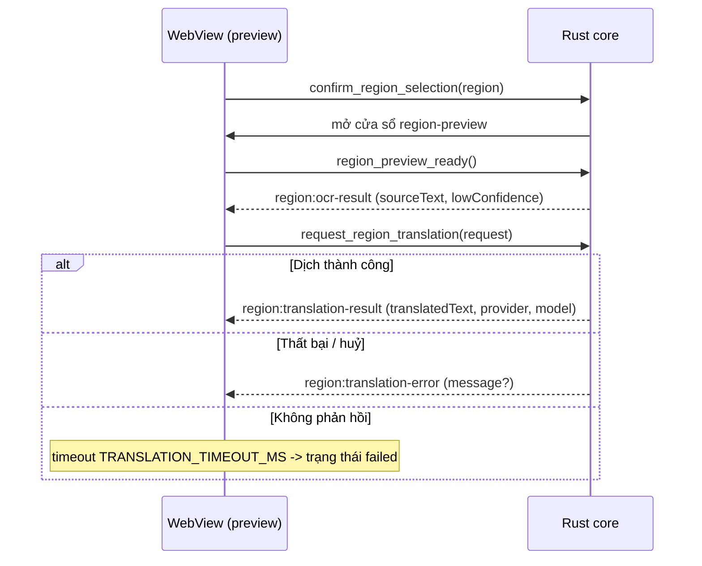

# Hợp đồng IPC - OST

Hợp đồng Tauri IPC (commands + events) giữa WebView (React) và Rust core. Tài liệu này là
nguồn tham chiếu chung; nó phải luôn khớp với hai file mã nguồn:

- `src/lib/ipc.ts` - wrapper IPC có kiểu ở phía frontend (mọi lời gọi frontend -> core đi qua
  đây, không import `invoke`/`listen` trực tiếp trong component/hook).
- `src-tauri/src/shell/region.rs` - các command handler + tên event vùng chọn ở phía core.
- `src-tauri/src/models/mod.rs` - các lệnh đồng thuận tải-model dùng chung (facility chung).

Khi thay đổi bất kỳ command, event hay payload nào: cập nhật cả ba nơi TRONG CÙNG một PR
(docs-workflow.md).

## Nguyên tắc chung

- Tên command dùng `snake_case`; tên event dùng namespace `domain:kebab-case`
  (ví dụ `region:ocr-result`).
- Payload tuần tự hoá sang `camelCase` (Rust `#[serde(rename_all = "camelCase")]`) để khớp
  với kiểu TypeScript.
- IPC chỉ mang toạ độ pixel và text; **không bao giờ** truyền byte ảnh/âm thanh qua ranh giới
  IPC (security-privacy.md). Ảnh chụp vùng nằm lại trong Rust core.
- Khoá provider **không bao giờ** xuất hiện trong payload IPC; WebView chỉ nhận tên provider +
  trạng thái đã che (agent-guardrails.md muc 3).
- Text từ OCR/dịch là **DATA không tin cậy**: WebView render bằng renderer plain-text (không
  `dangerouslySetInnerHTML`, không diễn giải markup) - human-in-the-loop.md, design-system.md.

## Kiểu dữ liệu dùng chung

### `RegionRect`

Hình chữ nhật vùng chọn theo pixel vật lý, gốc toạ độ là màn hình chính.

| Trường   | Kiểu     | Ghi chú                                  |
| -------- | -------- | ---------------------------------------- |
| `x`      | `number` | Toạ độ trái (px vật lý), `>= 0`.         |
| `y`      | `number` | Toạ độ trên (px vật lý), `>= 0`.         |
| `width`  | `number` | Chiều rộng, `> 0`, `<= 32768`.           |
| `height` | `number` | Chiều cao, `> 0`, `<= 32768`.            |

Core kiểm tra hợp lệ (`validate_region`); vùng rỗng hoặc vượt ngưỡng bị từ chối với lỗi
`invalid region`.

### `RegionTranslationRequest`

Yêu cầu dịch (lần đầu và khi dịch lại, AC-02.8).

| Trường       | Kiểu     | Ghi chú                                             |
| ------------ | -------- | --------------------------------------------------- |
| `requestId`  | `string` | Id do UI sinh (`ui-<n>`) để đối chiếu phản hồi.     |
| `sourceText` | `string` | Text nguồn từ OCR; không được rỗng.                 |
| `provider`   | `string` | Provider được chọn (gemini/anthropic/openai/...).   |
| `model`      | `string` | Model được chọn.                                    |

### `SourceLanguage` (ngôn ngữ nguồn do người dùng chọn)

Chuỗi ngôn ngữ nguồn theo BR-07 (tự phát hiện CỘNG ghim thủ công). Đi kèm lệnh
`confirm_region_selection` (tham số `sourceLanguage`).

| Giá trị            | Ý nghĩa                                                                 |
| ------------------ | ---------------------------------------------------------------------- |
| `"auto"` / rỗng    | Không ghim: tự phát hiện chỉ là GỢI Ý; KHÔNG khẳng định `degraded`.     |
| mã ISO 639-1       | Ghim thủ công (ví dụ `vi`, `ja`, `ko`, `en`, `zh`); chuẩn hoá lowercase. |

QUAN TRỌNG (sửa lỗi S1): tuyên bố `fidelity` và định tuyến rec-model theo ngôn ngữ
được CHỌN này, KHÔNG bao giờ theo ngôn ngữ phát hiện SAU OCR. PP-OCRv5 latin rec
rơi mất dấu thanh tiếng Việt (U+1E00-U+1EFF) nên các dấu này VẮNG khỏi output OCR;
phát hiện từ output sẽ nhầm `vi` thành `en` (Full) và thông báo Degraded bắt buộc
không bao giờ hiện. Định tuyến: `vi` + latin khác -> latin rec; `ja`/`zh`/`en` ->
main rec; `ko` -> korean rec; `auto` -> main (mặc định best-effort).

## Commands (frontend -> core)

Tất cả do `src-tauri/src/shell/region.rs` sở hữu; trả về `Result<(), ShellError>` (chuỗi lỗi
tuần tự hoá, không chứa nội dung người dùng hay bí mật).

| Command                     | Tham số                             | Vai trò                                                                 |
| --------------------------- | ----------------------------------- | ----------------------------------------------------------------------- |
| `start_region_selection`    | -                                   | Mở overlay chọn vùng toàn màn hình (AC-02.1).                           |
| `cancel_region_selection`   | -                                   | Đóng overlay chọn vùng, KHÔNG phát sự kiện chụp (đường Esc, AC-02.1).   |
| `confirm_region_selection`  | `region: RegionRect`, `sourceLanguage?: string` | Xác nhận vùng chọn (kèm ngôn ngữ nguồn, xem `SourceLanguage`), đóng overlay chọn, mở overlay preview. |
| `region_preview_ready`      | -                                   | Handshake: preview đã mount và lắng nghe; pipeline có thể bắt đầu phát. |
| `request_region_translation`| `request: RegionTranslationRequest` | Yêu cầu dịch/dịch lại text hiện tại (AC-02.8).                          |
| `set_region_live_update`    | `enabled: boolean`                  | Bật/tắt cập nhật trực tiếp vùng đã chọn (AC-02.4, nửa UI).              |
| `close_region_preview`      | -                                   | Đóng overlay preview.                                                    |
| `nudge_region_preview`      | `dx: number, dy: number`            | Dời overlay preview bằng bàn phím (AC-04.3); mỗi bước bị kẹp `<= 256`.  |

## Commands quản lý khoá provider (FR-03)

Do `src-tauri/src/commands/keys.rs` sở hữu; wrapper TypeScript là `keysIpc` trong `ipc.ts`.
Bất biến bảo mật (BR-02, NFR-SEC-01, AC-03.2/03.3): WebView gửi giá trị key XUỐNG đúng một
lần khi nhập, KHÔNG BAO GIỜ nhận lại key; mọi kiểu trả về chỉ là trạng thái masked, phán
quyết kiểm tra, hoặc lỗi có kiểu. Không command nào trả về `ApiKey` hay chuỗi key. Cửa sổ
Settings mở qua `open_settings` (`src-tauri/src/shell/settings.rs`).

| Command                 | Tham số                        | Trả về                        | Vai trò                                                                     |
| ----------------------- | ------------------------------ | ----------------------------- | -------------------------------------------------------------------------- |
| `provider_key_statuses` | -                              | `ProviderKeyStatus[]`         | Trạng thái masked (tên provider + `key_present`) cho cả 4 provider (AC-03.1/03.3). |
| `save_provider_key`     | `provider: string, key: string`| `SaveKeyOutcome`              | Kiểm tra (một lệnh gọi tối thiểu, AC-03.4) rồi lưu vào keychain (AC-03.2). Key sai KHÔNG được lưu. |
| `check_provider_key`    | `provider: string`             | `KeyValidation`               | Kiểm tra lại key đã lưu (đọc từ keychain trong core, key không qua IPC) - AC-03.4. |
| `delete_provider_key`   | `provider: string`             | `void`                        | Xoá key khỏi keychain (AC-03.7). Idempotent.                               |
| `open_settings`         | -                              | `void`                        | Mở cửa sổ Settings.                                                         |

Kiểu dữ liệu:

- `ProviderKeyStatus` = `{ provider_id: "gemini"|"anthropic"|"openai"|"openrouter", key_present: boolean }`
  (serde snake_case, khớp `keys/store.rs`). Đây là kiểu DUY NHẤT liên quan tới key mà WebView
  được nhận.
- `SaveKeyOutcome` = `{ status: "valid" } | { status: "stored" } | { status: "invalid", reason }`.
  Cả 4 provider đều đã có client (TASK-010) nên save/check luôn chạy kiểm tra key trực tiếp -
  `stored` giờ chỉ là nhánh dự phòng (no-client) còn lại ở lớp lệnh cho mục đích test.
  `reason` là chuỗi đã redact, không chứa key - UI hiển thị thông báo i18n của chính nó.
- `KeyValidation` = `{ status: "valid" } | { status: "invalid", reason }`.
- Lỗi command tuần tự hoá thành `{ kind }` với `kind` ∈ `unknownProvider | invalidInput |
  notConfigured | network | quota | timeout | config | keychain | provider`; UI ánh xạ `kind`
  sang thông báo i18n, không bao giờ render chuỗi backend thô.

## Lưu cấu hình lựa chọn provider (FR-03)

Lựa chọn provider/model mặc định + thứ tự fallback được lưu bằng `tauri-plugin-store`
(`settings.json`, khoá `providerSelection`) qua `src/lib/settings.ts`. CHỈ lưu TÊN
(provider id, model id, thứ tự) - KHÔNG BAO GIỜ lưu key (BR-02).

### Lệnh đồng thuận tải model (dùng chung - `src-tauri/src/models/`)

Cơ chế đồng thuận tải-model lần đầu là FACILITY DÙNG CHUNG (OCR là consumer đầu
tiên; whisper STT tái sử dụng ở Phase 2). FAIL-CLOSED TRONG RUST: việc tải model bị
TỪ CHỐI cho tới khi người dùng đồng thuận qua lệnh IPC - không phải cổng chỉ-ở-UI
(security-privacy.md, agent-guardrails.md 5). Cờ đồng thuận được LƯU (tauri-plugin-store,
chỉ cờ/tên, không bao giờ bí mật) và CÓ THỂ THU HỒI.

| Command                 | Tham số                 | Vai trò                                                                          |
| ----------------------- | ----------------------- | ------------------------------------------------------------------------------- |
| `model_consent_status`  | `modelSetId: string`    | Trả `ModelConsentStatus` (cờ `granted` + `disclosure` để UI hiển thị trước khi hỏi). |
| `grant_model_consent`   | `modelSetId: string`    | Cấp đồng thuận tải model (mở cổng fail-closed). Idempotent.                     |
| `revoke_model_consent`  | `modelSetId: string`    | Thu hồi đồng thuận (Settings). Lần tải kế tiếp lại fail-closed.                 |

`modelSetId` hiện dùng của OCR là `"ocr-ppocrv5"` (det + main/latin/korean rec + dict).

#### `ModelConsentStatus` / `ConsentDisclosure`

```ts
type ModelConsentStatus = {
  modelSetId: string;
  granted: boolean;
  disclosure: ConsentDisclosure;
};

type ConsentDisclosure = {
  modelSetId: string;
  displayName: string;
  hostName: string;    // "ModelScope"
  hostDomain: string;  // "modelscope.cn" - nêu rõ host, không che giấu
  artifacts: { filename: string; approxSizeBytes: number }[];
  totalApproxSizeBytes: number;
  destination: string; // thư mục cache trên đĩa (OAR_HOME, mặc định ~/.oar)
};
```

`disclosure` nêu RÕ host tải (ModelScope, modelscope.cn), kích thước từng artifact
và tổng, cùng đường dẫn đích - để người dùng quyết định có hiểu biết (đây là luồng
egress, security-reviewer soát). Tải qua HTTPS; oar-ocr `auto-download` xác minh
SHA-256 nội bộ. Coi mọi chuỗi là DATA (render plain-text).

## Events (core -> WebView)

Phát tới cửa sổ `region-preview` bằng `emit_to`. Tên hằng số nằm ở `region.rs`
(`EVENT_OCR_RESULT`, `EVENT_TRANSLATION_RESULT`, `EVENT_TRANSLATION_ERROR`) và ở `ipc.ts`
(`EVENT_REGION_OCR_RESULT`, `EVENT_REGION_TRANSLATION_RESULT`,
`EVENT_REGION_TRANSLATION_ERROR`).

### `region:ocr-result` -> `OcrResultPayload`

Phát khi OCR hoàn tất cho vùng đã chụp.

| Trường             | Kiểu               | Ghi chú                                                        |
| ------------------ | ------------------ | ------------------------------------------------------------- |
| `requestId`        | `string`           | Id tương quan (lõi sinh, dạng `region-ocr-<n>`).             |
| `sourceText`       | `string`           | Text nhận dạng được; rỗng/khoảng trắng nghĩa là không có text (AC-02.7). |
| `lowConfidence`    | `boolean`          | Cờ độ tin cậy thấp do pipeline tính (AC-02.6, BR-05); UI render nguyên trạng, không áp ngưỡng riêng. |
| `detectedLanguage` | `string \| null`   | Ngôn ngữ nguồn phát hiện được (tuỳ chọn).                     |
| `fidelity`         | `OcrFidelity`      | Tuyên bố độ trung thực nhận dạng cho ngôn ngữ nguồn đã phát hiện (bắt buộc, human-in-the-loop.md). Xem bên dưới. |

#### `OcrFidelity` (union gắn thẻ theo `kind`)

Union gắn thẻ, bắt buộc trên mọi `region:ocr-result`:

```ts
type OcrFidelity =
  | { kind: "full" }
  | { kind: "degraded"; reason: string };
```

- `full`: bộ ký tự của engine phủ đủ ngôn ngữ nguồn.
- `degraded`: engine nhận dạng được ngôn ngữ nhưng THIẾU một lớp ký tự; `reason`
  nêu tên bộ ký tự thiếu (plain text, coi là DATA, render không diễn giải markup).
  Với engine PaddleOCR PP-OCRv5 mặc định (ADR-004), tiếng Việt (`vi`) là
  `degraded`: các dấu thanh tổ hợp (Latin Extended Additional, U+1E00-U+1EFF)
  không có trong từ điển latin rec, nên bị rơi dù độ tin cậy theo dòng vẫn cao -
  vì vậy `lowConfidence` KHÔNG bắt được trường hợp này và cần tuyên bố riêng.
  UI phải hiển thị một thông báo cố định khi `degraded` (không đoán im lặng,
  human-in-the-loop.md). Các ngôn ngữ en/ja/ko/zh là `full`.

Ghi chú đồng bộ hằng số (docs-workflow.md): trường `fidelity` thuộc
`OcrResultPayload` phía Rust (`OcrFidelityPayload`, serde `#[serde(tag = "kind")]`
lowercase) và sẽ được `src/lib/ipc.ts` phản chiếu khi frontend tiêu thụ (task UI
riêng; PR này chỉ chốt hợp đồng, KHÔNG sửa `src/lib/ipc.ts`).

### `region:translation-result` -> `TranslationResultPayload`

Phát khi provider dịch xong.

| Trường           | Kiểu     | Ghi chú                                                    |
| ---------------- | -------- | --------------------------------------------------------- |
| `requestId`      | `string` | Phải khớp yêu cầu đang chờ; phản hồi lạc bị bỏ qua.       |
| `translatedText` | `string` | Bản dịch (render plain-text).                             |
| `provider`       | `string` | Provider thực sự đã dịch (AC-03.5, badge minh bạch).      |
| `model`          | `string` | Model thực sự đã dịch.                                    |

### `region:translation-error` -> `TranslationErrorPayload`

Phát khi yêu cầu dịch thất bại (lỗi provider, lỗi mạng, huỷ). Đưa preview ra khỏi trạng thái
"đang dịch" để UI không treo im lặng (human-in-the-loop.md, BR-05).

| Trường      | Kiểu               | Ghi chú                                                                                  |
| ----------- | ------------------ | --------------------------------------------------------------------------------------- |
| `requestId` | `string`           | Phải khớp yêu cầu đang chờ; lỗi lạc bị bỏ qua.                                          |
| `message`   | `string \| null`   | Chuỗi chẩn đoán tuỳ chọn, coi là DATA không tin cậy; UI hiển thị thông báo lỗi i18n của chính nó, không render chuỗi thô. |

Nếu không có sự kiện nào tới, UI tự chuyển sang trạng thái thất bại sau ngưỡng timeout
(`TRANSLATION_TIMEOUT_MS`, hiện 8000 ms) - dư dả so với NFR-PERF-02 (region p95 < 2s) nhưng
vẫn bảo đảm không treo vô hạn.

### `region:ocr-error` -> `OcrErrorPayload`

Phát khi CHỤP hoặc OCR thất bại (không phải lỗi thiếu đồng thuận - trường hợp đó dùng
`models:consent-required` bên dưới). Đưa preview ra khỏi trạng thái "đang nhận dạng" để
UI không treo im lặng (human-in-the-loop.md: không thất bại im lặng). Hằng số:
`EVENT_OCR_ERROR` (`region.rs`).

| Trường      | Kiểu               | Ghi chú                                                                                  |
| ----------- | ------------------ | --------------------------------------------------------------------------------------- |
| `requestId` | `string \| null`   | Id tương quan lõi sinh (`region-ocr-<n>`) nếu có.                                        |
| `message`   | `string \| null`   | Chuỗi chẩn đoán tuỳ chọn, coi là DATA không tin cậy (không có pixel/khoá/nội dung người dùng); UI hiển thị thông báo i18n của chính nó, không render chuỗi thô. |

### `models:consent-required` -> `ConsentDisclosure`

Phát khi OCR bị chặn vì chưa có đồng thuận tải model lần đầu (fail-closed). Mang
`ConsentDisclosure` (xem trên) để UI mở hộp thoại đồng thuận nêu host/kích thước/đích.
Namespace `models:` vì dùng chung (whisper STT tái dùng ở Phase 2). Hằng số:
`EVENT_MODEL_CONSENT_REQUIRED` (`region.rs`). Sau khi người dùng gọi `grant_model_consent`,
UI kích hoạt lại luồng preview (`region_preview_ready`) để chạy OCR.

## Trình tự vòng đời preview (SCR-03)



OCR rỗng (AC-02.7): UI vào trạng thái `empty` và KHÔNG gửi `request_region_translation`.
