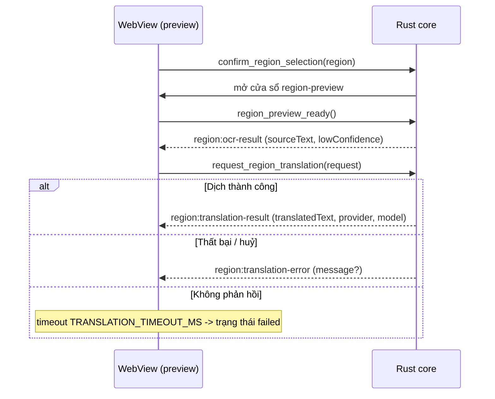

# Hợp đồng IPC - OST

Hợp đồng Tauri IPC (commands + events) giữa WebView (React) và Rust core. Tài liệu này là
nguồn tham chiếu chung; nó phải luôn khớp với hai file mã nguồn:

- `src/lib/ipc.ts` - wrapper IPC có kiểu ở phía frontend (mọi lời gọi frontend -> core đi qua
  đây, không import `invoke`/`listen` trực tiếp trong component/hook).
- `src-tauri/src/shell/region.rs` - các command handler và tên event ở phía core.

Khi thay đổi bất kỳ command, event hay payload nào: cập nhật cả ba nơi TRONG CÙNG một PR
(docs-workflow.md).

## Nguyên tắc chung

- Tên command dùng `snake_case`; tên event dùng namespace `domain:kebab-case`
  (ví dụ `region:ocr-result`).
- Payload tuần tự hoá sang `camelCase` (Rust `#[serde(rename_all = "camelCase")]`) để khớp
  với kiểu TypeScript.
- IPC chỉ mang toạ độ pixel và text; **không bao giờ** truyền byte ảnh/âm thanh qua ranh giới
  IPC (security-privacy.md). Ảnh chụp vùng nằm lại trong Rust core.
- Khoá provider **không bao giờ** xuất hiện trong payload IPC; WebView chỉ nhận tên provider +
  trạng thái đã che (agent-guardrails.md muc 3).
- Text từ OCR/dịch là **DATA không tin cậy**: WebView render bằng renderer plain-text (không
  `dangerouslySetInnerHTML`, không diễn giải markup) - human-in-the-loop.md, design-system.md.

## Kiểu dữ liệu dùng chung

### `RegionRect`

Hình chữ nhật vùng chọn theo pixel vật lý, gốc toạ độ là màn hình chính.

| Trường   | Kiểu     | Ghi chú                                  |
| -------- | -------- | ---------------------------------------- |
| `x`      | `number` | Toạ độ trái (px vật lý), `>= 0`.         |
| `y`      | `number` | Toạ độ trên (px vật lý), `>= 0`.         |
| `width`  | `number` | Chiều rộng, `> 0`, `<= 32768`.           |
| `height` | `number` | Chiều cao, `> 0`, `<= 32768`.            |

Core kiểm tra hợp lệ (`validate_region`); vùng rỗng hoặc vượt ngưỡng bị từ chối với lỗi
`invalid region`.

### `RegionTranslationRequest`

Yêu cầu dịch (lần đầu và khi dịch lại, AC-02.8).

| Trường       | Kiểu     | Ghi chú                                             |
| ------------ | -------- | --------------------------------------------------- |
| `requestId`  | `string` | Id do UI sinh (`ui-<n>`) để đối chiếu phản hồi.     |
| `sourceText` | `string` | Text nguồn từ OCR; không được rỗng.                 |
| `provider`   | `string` | Provider được chọn (gemini/anthropic/openai/...).   |
| `model`      | `string` | Model được chọn.                                    |

## Commands (frontend -> core)

Tất cả do `src-tauri/src/shell/region.rs` sở hữu; trả về `Result<(), ShellError>` (chuỗi lỗi
tuần tự hoá, không chứa nội dung người dùng hay bí mật).

| Command                     | Tham số                             | Vai trò                                                                 |
| --------------------------- | ----------------------------------- | ----------------------------------------------------------------------- |
| `start_region_selection`    | -                                   | Mở overlay chọn vùng toàn màn hình (AC-02.1).                           |
| `cancel_region_selection`   | -                                   | Đóng overlay chọn vùng, KHÔNG phát sự kiện chụp (đường Esc, AC-02.1).   |
| `confirm_region_selection`  | `region: RegionRect`                | Xác nhận vùng chọn, đóng overlay chọn, mở overlay preview.              |
| `region_preview_ready`      | -                                   | Handshake: preview đã mount và lắng nghe; pipeline có thể bắt đầu phát. |
| `request_region_translation`| `request: RegionTranslationRequest` | Yêu cầu dịch/dịch lại text hiện tại (AC-02.8).                          |
| `set_region_live_update`    | `enabled: boolean`                  | Bật/tắt cập nhật trực tiếp vùng đã chọn (AC-02.4, nửa UI).              |
| `close_region_preview`      | -                                   | Đóng overlay preview.                                                    |
| `nudge_region_preview`      | `dx: number, dy: number`            | Dời overlay preview bằng bàn phím (AC-04.3); mỗi bước bị kẹp `<= 256`.  |

## Events (core -> WebView)

Phát tới cửa sổ `region-preview` bằng `emit_to`. Tên hằng số nằm ở `region.rs`
(`EVENT_OCR_RESULT`, `EVENT_TRANSLATION_RESULT`, `EVENT_TRANSLATION_ERROR`) và ở `ipc.ts`
(`EVENT_REGION_OCR_RESULT`, `EVENT_REGION_TRANSLATION_RESULT`,
`EVENT_REGION_TRANSLATION_ERROR`).

### `region:ocr-result` -> `OcrResultPayload`

Phát khi OCR hoàn tất cho vùng đã chụp.

| Trường             | Kiểu               | Ghi chú                                                        |
| ------------------ | ------------------ | ------------------------------------------------------------- |
| `requestId`        | `string`           | Id tương quan.                                                |
| `sourceText`       | `string`           | Text nhận dạng được; rỗng/khoảng trắng nghĩa là không có text (AC-02.7). |
| `lowConfidence`    | `boolean`          | Cờ độ tin cậy thấp do pipeline tính (AC-02.6, BR-05); UI render nguyên trạng, không áp ngưỡng riêng. |
| `detectedLanguage` | `string \| null`   | Ngôn ngữ nguồn phát hiện được (tuỳ chọn).                     |

### `region:translation-result` -> `TranslationResultPayload`

Phát khi provider dịch xong.

| Trường           | Kiểu     | Ghi chú                                                    |
| ---------------- | -------- | --------------------------------------------------------- |
| `requestId`      | `string` | Phải khớp yêu cầu đang chờ; phản hồi lạc bị bỏ qua.       |
| `translatedText` | `string` | Bản dịch (render plain-text).                             |
| `provider`       | `string` | Provider thực sự đã dịch (AC-03.5, badge minh bạch).      |
| `model`          | `string` | Model thực sự đã dịch.                                    |

### `region:translation-error` -> `TranslationErrorPayload`

Phát khi yêu cầu dịch thất bại (lỗi provider, lỗi mạng, huỷ). Đưa preview ra khỏi trạng thái
"đang dịch" để UI không treo im lặng (human-in-the-loop.md, BR-05).

| Trường      | Kiểu               | Ghi chú                                                                                  |
| ----------- | ------------------ | --------------------------------------------------------------------------------------- |
| `requestId` | `string`           | Phải khớp yêu cầu đang chờ; lỗi lạc bị bỏ qua.                                          |
| `message`   | `string \| null`   | Chuỗi chẩn đoán tuỳ chọn, coi là DATA không tin cậy; UI hiển thị thông báo lỗi i18n của chính nó, không render chuỗi thô. |

Nếu không có sự kiện nào tới, UI tự chuyển sang trạng thái thất bại sau ngưỡng timeout
(`TRANSLATION_TIMEOUT_MS`, hiện 8000 ms) - dư dả so với NFR-PERF-02 (region p95 < 2s) nhưng
vẫn bảo đảm không treo vô hạn.

## Trình tự vòng đời preview (SCR-03)

OCR rỗng (AC-02.7): UI vào trạng thái `empty` và KHÔNG gửi `request_region_translation`.
