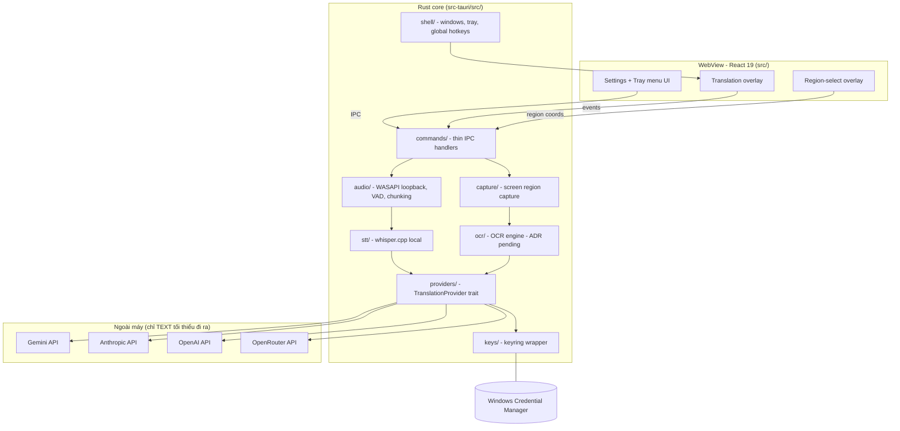

# Kiến trúc tổng quan - OST

Desktop app Tauri 2: Rust core sở hữu toàn bộ pipeline nặng; WebView (React) chỉ là bề mặt
tương tác. Windows-first, mọi thành phần phụ thuộc OS đều nằm sau trait để Phase 4 thay
impl cho macOS/Linux.

## Luồng dữ liệu

- **FR-01 audio**: loopback capture (chunk ~1-3s + VAD) -> whisper.cpp local (audio KHÔNG
  rời máy) -> text gốc -> providers/ dịch -> event -> overlay song ngữ.
- **FR-02 vùng màn hình**: chọn vùng (RS overlay) -> capture -> OCR -> hiển thị text nhận
  dạng ngay (preview) -> providers/ dịch -> cập nhật preview.
- **FR-03 keys**: Settings UI -> IPC -> keys/ -> Credential Manager. WebView chỉ nhận
  provider name + trạng thái masked, không bao giờ nhận giá trị key.

## Ràng buộc hiệu năng (FR-05, gate mọi merge vào pipeline)

| Chỉ số | Budget |
|--------|--------|
| Audio caption end-to-end | p95 < 3s |
| Region translate sau khi chọn vùng | p95 < 2s |
| Idle (không có phiên hoạt động) | RAM < 100MB, CPU < 1% |

Chi tiết stack: `.claude/rules/tech-stack.md`. Quyết định nền tảng: ADR-001..003.
