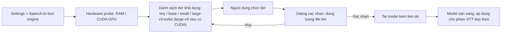
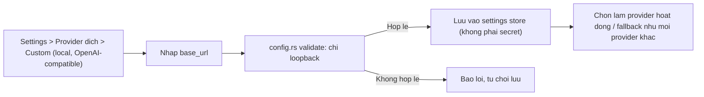

# PRD: Lựa chọn backend STT và provider dịch local (FR-01, FR-03)

> Yêu cầu nguồn: [FR-01](../specs/05-functional-requirements.md#fr-01),
> [FR-03](../specs/05-functional-requirements.md#fr-03). Tài liệu này gộp HAI tính năng
> tách biệt trong cùng một sprint thiết kế (TASK-026): (A) bộ chọn engine/model STT cho
> FR-01, và (B) một entry provider dịch local mới cho FR-03. Hai mục KHÔNG trộn lẫn trên
> UI - xem mục 3 "Ranh giới hai bộ chọn".

## 1. Bối cảnh và vấn đề

Hiện tại FR-01 chỉ dùng một model whisper.cpp cố định (mặc định `base`) được chọn qua dò
phần cứng lần chạy đầu (BR-08). Người dùng có máy mạnh hơn (nhiều RAM, có GPU CUDA) không
đổi được sang model chính xác hơn; người dùng máy yếu không hạ được xuống model nhẹ hơn nếu
gợi ý ban đầu không phù hợp. Ngoài ra, chủ dự án muốn khảo sát khả năng dùng backend STT đám
mây (Google Cloud STT, Azure AI Speech, OpenAI gpt-realtime-whisper) trong tương lai, nhưng
việc này gửi RAW AUDIO ra khỏi máy - mâu thuẫn với tiền đề đã Accepted của ADR-002 và BR-01,
nên cần một ADR mới (xem [ADR-005](../architecture/decisions/ADR-005-cloud-stt-opt-in.md))
và không được lập trình trước khi chủ dự án ký duyệt.

Song song, có một nhu cầu tách biệt: người dùng chạy LLM local qua LM Studio (expose một
API tương thích OpenAI trên `localhost`) muốn dùng chính máy mình làm provider DỊCH (không
phải STT) mà không cần API key của bên thứ ba và không có egress nào ra ngoài máy. Provider
layer (FR-03) và `config.rs` đã có sẵn logic validate base URL loopback-only, nên đây là một
bổ sung nhỏ, không cần sửa spec.

## 2. Mục tiêu và chỉ số thành công

- Settings có một bộ chọn "Speech-to-text engine" tách biệt hoàn toàn khỏi bộ chọn provider
  dịch (FR-03), hiển thị đúng các tier whisper local khả dụng theo phần cứng máy.
- Đổi model whisper trong Settings tái dùng nguyên luồng consent-download của BR-08 (dò phần
  cứng -> gợi ý -> xác nhận kèm dung lượng file -> tải kèm tiến độ), mở rộng từ "chỉ lần chạy
  đầu" sang "bất kỳ lúc nào trong Settings" (AC-01.8).
- Không tier nào được gợi ý/cho phép nếu vi phạm ngân sách hiệu năng BR-04 (idle RAM < 100MB,
  CPU < 1% khi idle; p95 audio < 3s khi đang chạy phiên).
- Provider dịch có thêm một entry "Custom (local, OpenAI-compatible)" nhận `base_url` thay vì
  API key, chỉ chấp nhận địa chỉ loopback, không có egress mạng ngoài máy - phục vụ LM Studio
  và các server tương thích OpenAI chạy local tương tự.
- Backend STT đám mây (Google Cloud STT, Azure AI Speech, OpenAI gpt-realtime-whisper) xuất
  hiện trong danh sách ở trạng thái xám/disabled kèm tooltip "chờ ADR-005 được duyệt", để
  người dùng biết lộ trình mà không bật được cho tới khi có sign-off.

## 3. Phạm vi (trong / ngoài)

**Trong phạm vi (sprint hiện tại, không cần sửa spec):**

- Bộ chọn model whisper local trong Settings: tiny / base (mặc định) / small /
  large-v3-turbo, hiển thị theo điều kiện phần cứng (mục 4, FR-01.x).
- Mở rộng luồng consent-download BR-08 để dùng lại được khi đổi model trong Settings, không
  chỉ ở lần chạy đầu.
- Entry provider dịch "Custom (local, OpenAI-compatible)" nhận `base_url`, loopback-only
  (mục 4, FR-03.x).
- Cảnh báo trạng thái chờ duyệt cho các mục cloud STT (hiển thị nhưng disabled).

**Ngoài phạm vi (chờ sign-off riêng, KHÔNG lập trình ở sprint này):**

- Bất kỳ lệnh gọi STT đám mây thực sự nào (Google Cloud STT, Azure AI Speech, OpenAI
  gpt-realtime-whisper) - bị chặn cứng cho tới khi chủ dự án ký duyệt
  [ADR-005](../architecture/decisions/ADR-005-cloud-stt-opt-in.md) và các amendment BR-01/
  NFR-SEC-03/BR-10 đi kèm.
- Endpoint speech-translation gộp STT+dịch của Azure (ngoài phạm vi provider layer FR-03) -
  còn là câu hỏi mở trong ADR-005.
- Model `medium` (loại khỏi lineup - không có lợi thế chính xác so với large-v3-turbo trong
  khi tốn ~5GB RAM, xem mục 6).

### Ranh giới hai bộ chọn

Bộ chọn STT (Settings > Speech-to-text engine) và bộ chọn provider dịch (Settings > FR-03
provider) là HAI control riêng biệt, không dùng chung danh sách, không dùng chung state:

| | Bộ chọn STT (FR-01) | Bộ chọn provider dịch (FR-03) |
|---|---|---|
| Việc thực hiện | Audio -> text (nhận dạng tiếng nói) | Text -> text (dịch) |
| Các lựa chọn | whisper local (tiny/base/small/turbo); cloud STT (disabled, chờ ADR-005) | Gemini, Anthropic, OpenAI, OpenRouter, Custom (local, OpenAI-compatible) |
| Custom (local, OpenAI-compatible) xuất hiện ở đây? | KHÔNG | CÓ |

Entry "Custom (local, OpenAI-compatible)" (LM Studio) chỉ phục vụ dịch text, không bao giờ
xuất hiện trong bộ chọn STT - LM Studio host các model LLM, không có ASR. Nêu rõ điều này để
tránh người dùng nhầm lẫn hai vai trò.

## 4. Yêu cầu chi tiết

### A. Bộ chọn engine STT (FR-01)

| ID | Yêu cầu | Ưu tiên | Tiêu chí chấp nhận |
|----|---------|---------|--------------------|
| FR-01.STT-1 | Settings hiển thị bộ chọn "Speech-to-text engine" liệt kê các tier whisper local: tiny, base (mặc định), small, large-v3-turbo. `medium` không xuất hiện trong lineup. | Must | AC-01.8 |
| FR-01.STT-2 | `large-v3` chỉ hiển thị khi hardware probe phát hiện GPU CUDA tương thích; khi hiển thị, kèm ghi chú rõ ràng "yêu cầu GPU CUDA". | Must | AC-01.8, BR-04 |
| FR-01.STT-3 | Đổi model trong Settings tái sử dụng nguyên luồng consent-download BR-08: dò phần cứng -> gợi ý -> dialog xác nhận nêu đúng dung lượng file của tier -> tải kèm tiến độ. Không tự tải khi chưa xác nhận. | Must | AC-01.8, BR-08 |
| FR-01.STT-4 | Hardware probe áp một mức sàn RAM: không gợi ý/không cho chọn `small` hoặc `large-v3-turbo` nếu RAM máy không đủ giữ ngân sách BR-04 (idle < 100MB, p95 audio < 3s). Tier vượt sàn RAM bị ẩn hoặc disabled kèm lý do. | Must | BR-04 |
| FR-01.STT-5 | `large-v3-turbo` ở trạng thái AVAILABLE nhưng KHÔNG được đánh dấu RECOMMENDED cho tới khi spot-test tiếng Nhật đạt (xem mục 6, "Cổng xác thực turbo"). Trước khi spot-test đạt, UI không gắn nhãn khuyến nghị lên tier này; `base` vẫn là mặc định/khuyến nghị. | Must | Nghiên cứu tech-researcher 2026-07-11 |
| FR-01.STT-6 | Các entry STT đám mây (Google Cloud STT, Azure AI Speech, OpenAI gpt-realtime-whisper) hiển thị ở trạng thái xám/disabled, kèm tooltip "chờ ADR-005 được duyệt". Không có đường chọn/kích hoạt nào khả dụng. | Must | ADR-005 (Proposed) |

### B. Provider dịch local OpenAI-compatible (FR-03)

| ID | Yêu cầu | Ưu tiên | Tiêu chí chấp nhận |
|----|---------|---------|--------------------|
| FR-03.CUSTOM-1 | Danh sách provider dịch trong Settings có thêm entry "Custom (local, OpenAI-compatible)", nhận một trường `base_url` thay vì API key. | Must | AC-03.1 (mở rộng) |
| FR-03.CUSTOM-2 | `base_url` chỉ chấp nhận địa chỉ loopback (`127.0.0.1` / `localhost`); giá trị không loopback bị từ chối ngay tại validate của `config.rs` (đã có sẵn), không gửi đi đâu. | Must | BR-01, NFR-SEC-03 |
| FR-03.CUSTOM-3 | Entry này không yêu cầu và không lưu API key trong keychain; nếu server local yêu cầu một token tuỳ chọn, trường đó (nếu thêm sau) tuân BR-02 như mọi provider khác. | Must | BR-02 |
| FR-03.CUSTOM-4 | Toàn bộ lệnh gọi entry này đi qua provider layer chung (`TranslationProvider` trait) như các provider khác - không có đường tắt riêng trong UI hay command handler. | Must | tech-stack.md, coding-standards.md |
| FR-03.CUSTOM-5 | Entry này không xuất hiện và không thể chọn được trong bộ chọn STT (FR-01); tài liệu UI/tooltip nêu rõ đây là provider DỊCH, không phải STT. | Must | Mục 3 "Ranh giới hai bộ chọn" |

## 5. User flow (Mermaid)

Đổi model whisper trong Settings (tái dùng luồng BR-08 / [BF-04](../specs/04-business-flows.md#bf-04)):

Thêm provider dịch local (LM Studio):

## 6. Ràng buộc kỹ thuật

- **Lineup model whisper (bằng chứng tech-researcher, 2026-07-11):** RAM runtime tham khảo -
  `base` ~388MB, `small` ~2GB, `medium` ~5GB (loại khỏi lineup, không có lợi thế chính xác so
  với `large-v3-turbo`), `large-v3` ~3.9GB (vượt ngân sách p95 < 3s trên CPU thuần, chỉ khả
  thi khi có GPU CUDA). `large-v3-turbo`: 809M tham số, 4 lớp decoder, nhanh hơn `large-v3`
  2-5 lần với độ chính xác gần tương đương.
- **Dung lượng file tải (hiển thị đúng trong dialog consent):** tiny ~75MB, base ~142MB,
  small ~466MB, large-v3-turbo ~1.6GB.
- **Cổng xác thực turbo:** `large-v3-turbo` có một quirk đã ghi nhận - token tiếng Anh lạc
  vào output tiếng Nhật (openai/whisper discussion #2363). Tier này ở trạng thái AVAILABLE
  ngay khi lineup ra mắt nhưng chỉ chuyển sang RECOMMENDED sau khi một spot-test tiếng Nhật
  (nội bộ, trước khi gỡ cảnh báo) xác nhận không còn hiện tượng lẫn token tiếng Anh ở mức gây
  khó chịu. Cho tới lúc đó, `base` vẫn là mặc định/khuyến nghị.
- **Không có ASR local nào đáng tin cậy hơn whisper.cpp cho ja/en trên Windows tiêu dùng**
  (tech-researcher 2026-07-11): faster-whisper cần CUDA và không có binding Rust; Parakeet/
  Canary khoá GPU + chỉ chạy qua WSL; Vosk hy sinh độ chính xác; SpeechT5 không cạnh tranh.
  Vì vậy lineup vẫn dựa trên whisper.cpp qua `whisper-rs` (không đổi so với ADR-002).
- **Sàn RAM (hardware-probe guardrail):** hardware probe không gợi ý hay cho phép chọn
  `small`/`large-v3-turbo` nếu RAM máy không đủ giữ ngân sách BR-04 (idle < 100MB RAM/ < 1%
  CPU; p95 audio < 3s). Ngưỡng RAM cụ thể theo tier chốt ở thiết kế kỹ thuật của task triển
  khai, dựa trên các con số RAM runtime ở trên cộng biên an toàn.
- **Custom (local, OpenAI-compatible):** dùng lại client OpenAI hiện có của provider layer
  với `base_url` tuỳ biến; `config.rs` đã validate loopback-only, không cần thay đổi spec.
  Không phát sinh egress mạng ra ngoài máy (BR-01, NFR-SEC-03).
- **Cloud STT (Google Cloud STT, Azure AI Speech, OpenAI gpt-realtime-whisper):** KHÔNG được
  lập trình ở sprint này. Xem đầy đủ khung quyết định, các điều kiện tiên quyết và câu hỏi mở
  tại [ADR-005](../architecture/decisions/ADR-005-cloud-stt-opt-in.md) (Proposed - chờ chủ dự
  án ký duyệt).
- **Thứ tự triển khai đã chốt (TASK-026):**
  1. Bộ chọn model whisper (local, không cần sửa spec).
  2. Provider dịch local Custom/base_url (loopback, không cần sửa spec).
  3. STT đám mây - chặn cho tới khi chủ dự án ký duyệt ADR-005.
- UI theo design-system (primitives + tokens); Select tuỳ biến (không dùng `<select>` native)
  cho cả hai bộ chọn; tooltip dùng primitive `Tooltip` (không dùng `title=` thô) cho ghi chú
  "yêu cầu GPU CUDA" và "chờ ADR-005 được duyệt".

## 7. Câu hỏi mở

- Ngưỡng RAM cụ thể (số MB) cho từng mức sàn `small`/`large-v3-turbo` - chốt ở thiết kế kỹ
  thuật của task triển khai model switcher.
- Nội dung và tiêu chí đạt/không đạt chính xác của spot-test tiếng Nhật cho `large-v3-turbo`
  (mục 6, "Cổng xác thực turbo") - cần một task riêng trước khi gắn nhãn RECOMMENDED.
- Toàn bộ câu hỏi mở về cloud STT (phạm vi Azure speech-translation endpoint, giữ hay bỏ
  OpenAI gpt-realtime-whisper làm ứng viên thứ ba, có nên giới hạn cloud STT vào một niche
  máy yếu/laptop thay vì một lựa chọn đại trà) nằm trong ADR-005, chờ chủ dự án trả lời.

## 8. Tham chiếu

- Specs: [FR-01](../specs/05-functional-requirements.md#fr-01),
  [FR-03](../specs/05-functional-requirements.md#fr-03),
  [AC-01.8](../specs/05-functional-requirements.md#fr-01),
  [BF-04](../specs/04-business-flows.md#bf-04)
- Business rules: [BR-01, BR-02, BR-04, BR-08](../context/business-rules.md)
- Kiến trúc: [ADR-002](../architecture/decisions/ADR-002-local-whisper-stt.md) (STT local,
  Accepted), [ADR-004](../architecture/decisions/ADR-004-pluggable-ocr-backends.md) (mẫu tiền
  lệ cho owner-gated cloud opt-in), [ADR-005](../architecture/decisions/ADR-005-cloud-stt-opt-in.md)
  (Proposed - cloud STT)
- Tasks: [TASK-026](../tasks/active/TASK-026-stt-backend-options.md)
