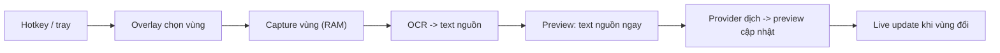

# PRD: Dịch vùng màn hình có preview (FR-02)

> Yêu cầu nguồn: [FR-02](../specs/05-functional-requirements.md#fr-02)

## 1. Bối cảnh và vấn đề

Người dùng gặp text ngoại ngữ trên màn hình (game, UI phần mềm, ảnh, video có chữ) không
copy được bằng chuột. Cách hiện tại - chụp màn hình, upload/paste vào công cụ dịch - chậm
và đứt mạch làm việc. FR-02 cho phép quét chọn một vùng bất kỳ và nhận bản dịch trong
preview overlay gần như tức thì, cập nhật trực tiếp khi nội dung vùng thay đổi.

## 2. Mục tiêu và chỉ số thành công

- Từ lúc chốt vùng đến khi bản dịch hiển thị: p95 < 2s (AC-02.2, NFR-PERF-02).
- Live update khi nội dung vùng đổi: p95 < 2s từ khi phát hiện thay đổi (AC-02.4).
- Ảnh chụp không bao giờ ghi đĩa hay rời máy; chỉ TEXT OCR đến provider (AC-02.5).
- Đây là tính năng đích của Phase 1 (đường dọc đầu tiên qua provider layer).

## 3. Phạm vi (trong / ngoài)

- Trong: chọn vùng chữ nhật bất kỳ trên một màn hình; OCR + dịch + preview; live update;
  copy / re-translate / pin / đóng; confidence flag; ghi lịch sử text-only nếu đang bật.
- Ngoài: OCR file/tài liệu; dịch toàn màn hình tự động không chọn vùng; nhiều vùng đồng
  thời (cân nhắc sau MVP); macOS/Linux (Phase 4).

## 4. Yêu cầu chi tiết

| ID | Yêu cầu | Ưu tiên | Tiêu chí chấp nhận |
|----|---------|---------|--------------------|
| FR-02.1 | Overlay chọn vùng toàn màn hình, kéo chọn chữ nhật, Esc huỷ | Must | AC-02.1 |
| FR-02.2 | Pipeline capture -> OCR -> dịch đạt p95 < 2s sau chốt vùng | Must | AC-02.2 |
| FR-02.3 | Preview hiện text OCR ngay, bản dịch cập nhật sau | Must | AC-02.3 |
| FR-02.4 | Live update khi nội dung vùng thay đổi | Must | AC-02.4 |
| FR-02.5 | Ảnh chỉ trong RAM; chỉ TEXT OCR gửi provider | Must | AC-02.5 |
| FR-02.6 | Confidence flag cho vùng nhận dạng kém | Must | AC-02.6 |
| FR-02.7 | Trạng thái "không nhận dạng được text", không gọi LLM khi OCR trống | Must | AC-02.7 |
| FR-02.8 | Re-translate cùng text OCR, đổi được provider/model trước khi gửi | Must | AC-02.8 |
| FR-02.9 | Preview đủ điều khiển: copy, re-translate, pin, đóng; badge provider/model; thao tác đủ bàn phím | Must | AC-02.9 |

## 5. User flow (Mermaid)

Xem [BF-02](../specs/04-business-flows.md#bf-02). Tóm tắt:

## 6. Ràng buộc kỹ thuật

- Engine OCR CHƯA chốt - chặn implement pipeline OCR: [OI-01](../specs/11-assumptions-constraints.md#oi-01)
  (TASK-005 bakeoff -> ADR).
- Capture qua trait `ScreenCapturer` (xcap hoặc Windows Graphics Capture); OCR qua trait
  `OcrEngine` (CT-07).
- Mọi lệnh dịch qua provider layer FR-03; prompt tách chỉ thị/dữ liệu, response
  schema-validate, render plain text ([NFR-SEC-06](../specs/07-non-functional-requirements.md#nfr-security)).
- UI theo design-system (primitives + tokens); màn hình liên quan:
  [SCR-02, SCR-03](../specs/10-ui-ux-wireframes.md#scr-02).

## 7. Câu hỏi mở

- OI-01: engine OCR (quyết định trước khi code pipeline).
- OI-07: ngưỡng confidence cụ thể cho flag OCR.
- Tần suất/cơ chế phát hiện thay đổi vùng ở chế độ live (polling interval vs diff ảnh) -
  chốt khi thiết kế kỹ thuật, phải giữ budget NFR-PERF-02 và không phá idle budget.

## 8. Tham chiếu

- Specs: [FR-02](../specs/05-functional-requirements.md#fr-02),
  [UC-03](../specs/05-functional-requirements.md#uc-03),
  [BF-02](../specs/04-business-flows.md#bf-02),
  [12-technical-feasibility.md](../specs/12-technical-feasibility.md#feasibility-table)
- Kiến trúc: [system-overview.md](../architecture/system-overview.md)
- Tasks: TASK-005 (OCR ADR), TASK-007 (capture + OCR pipeline), TASK-008 (region-select UI)
