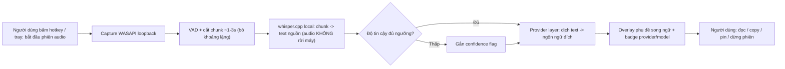
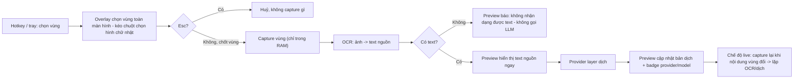
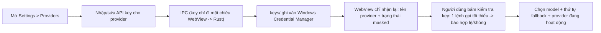
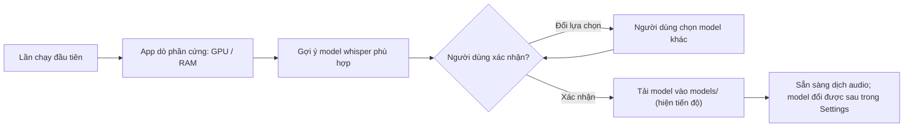
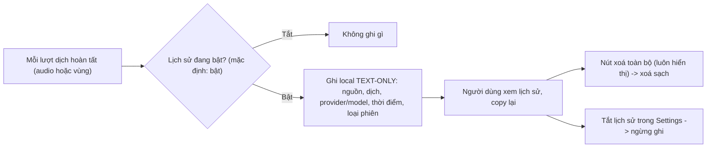

# 04 - Luồng nghiệp vụ {#business-flows}

Bốn luồng đầu-cuối cốt lõi. Chi tiết yêu cầu tại
[05-functional-requirements.md](05-functional-requirements.md); màn hình tương ứng tại
[10-ui-ux-wireframes.md](10-ui-ux-wireframes.md).

## BF-01: Dịch audio hệ thống trực tiếp (FR-01) {#bf-01}

- Ngôn ngữ nguồn: whisper tự nhận diện, hoặc dùng ngôn ngữ người dùng đã ghim (BR-07).
- Chỉ TEXT đã transcribe được gửi đến provider (BR-01).

## BF-02: Dịch vùng màn hình có preview (FR-02) {#bf-02}

## BF-03: Thiết lập provider và API key (FR-03) {#bf-03}

## BF-04: Lần chạy đầu - chọn model whisper (FR-01) {#bf-04}

## BF-05: Vòng đời lịch sử dịch (FR-04) {#bf-05}

Không bao giờ ghi audio, ảnh chụp hay key vào lịch sử (BR-06,
[NFR-SEC-04](07-non-functional-requirements.md#nfr-security)).
