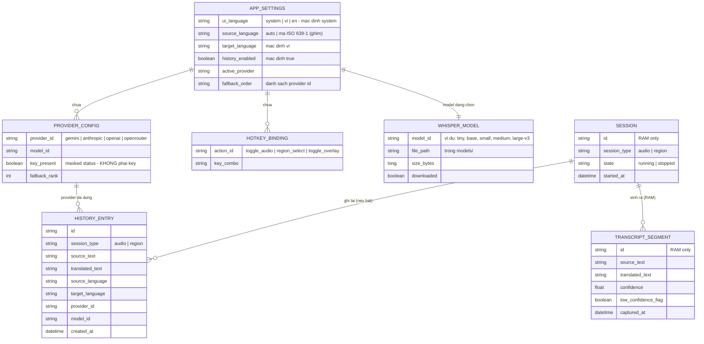

# 08 - Mô hình dữ liệu {#data-model}

OST không có database server. Dữ liệu chia hai lớp:

- **Lưu đĩa (local)**: cấu hình (tauri-plugin-store, JSON), lịch sử dịch (text-only),
  registry model whisper. KHÔNG BAO GIỜ chứa key/audio/ảnh.
- **Chỉ trong RAM (phiên)**: audio buffer, ảnh chụp, segment STT/OCR - biến mất khi phiên
  dừng ([NFR-SEC-03](07-non-functional-requirements.md#nfr-security)).
- **OS keychain**: giá trị API key - ngoài mô hình dữ liệu của app (ADR-003).

## Sơ đồ ER

## Từ điển dữ liệu

### APP_SETTINGS (lưu đĩa - tauri-plugin-store)

| Trường | Kiểu | Bắt buộc | Mô tả | Ví dụ |
|--------|------|----------|-------|-------|
| ui_language | string enum | Có | Ngôn ngữ UI: `system`, `vi`, `en`; mặc định `system` - phân giải theo ngôn ngữ hiển thị của OS thành `vi` nếu OS tiếng Việt, ngược lại `en` (AC-04.7) | `system` |
| source_language | string | Có | `auto` (whisper tự nhận diện) hoặc mã ISO 639-1 khi người dùng ghim (BR-07) | `auto`, `ja` |
| target_language | string | Có | Ngôn ngữ đích, mặc định `vi` (BR-07) | `vi` |
| history_enabled | boolean | Có | Lịch sử dịch, mặc định `true` (BR-06) | `true` |
| active_provider | string | Không | Provider đang hoạt động | `gemini` |
| fallback_order | string[] | Không | Thứ tự fallback do người dùng định (AC-03.6) | `["gemini","openrouter"]` |

### PROVIDER_CONFIG (lưu đĩa - không chứa key)

| Trường | Kiểu | Bắt buộc | Mô tả | Ví dụ |
|--------|------|----------|-------|-------|
| provider_id | string enum | Có | `gemini`, `anthropic`, `openai`, `openrouter` | `anthropic` |
| model_id | string | Không | Model người dùng chọn cho provider | `claude-sonnet-4-5` |
| key_present | boolean | Có | Trạng thái masked lấy từ keychain - KHÔNG phải giá trị key (BR-02) | `true` |
| fallback_rank | int | Không | Vị trí trong thứ tự fallback | `1` |

### HOTKEY_BINDING (lưu đĩa)

| Trường | Kiểu | Bắt buộc | Mô tả | Ví dụ |
|--------|------|----------|-------|-------|
| action_id | string enum | Có | `toggle_audio`, `region_select`, `toggle_overlay` (AC-04.1) | `region_select` |
| key_combo | string | Có | Tổ hợp phím; mặc định chưa chốt ([OI-04](11-assumptions-constraints.md#oi-04)) | `Ctrl+Shift+R` |

### WHISPER_MODEL (lưu đĩa - registry model)

| Trường | Kiểu | Bắt buộc | Mô tả | Ví dụ |
|--------|------|----------|-------|-------|
| model_id | string | Có | Định danh model whisper.cpp; ví dụ: `tiny`, `base`, `small`, `medium`, `large-v3` (gồm cả biến thể ggml/quantized) - catalog cụ thể chốt khi thiết kế kỹ thuật | `small` |
| file_path | string | Có khi đã tải | Đường dẫn file ggml trong `models/` (gitignored) | `models/ggml-small.bin` |
| size_bytes | long | Không | Kích thước để hiển thị khi gợi ý | `487000000` |
| downloaded | boolean | Có | Đã tải xong và kiểm toàn vẹn chưa (NFR-REL-04) | `true` |

### HISTORY_ENTRY (lưu đĩa - text-only, BR-06)

| Trường | Kiểu | Bắt buộc | Mô tả | Ví dụ |
|--------|------|----------|-------|-------|
| id | string (uuid) | Có | Định danh bản ghi | `018f...` |
| session_type | string enum | Có | `audio` hoặc `region` | `audio` |
| source_text | string | Có | Text nguồn (STT/OCR) - TEXT thuần | `Hello world` |
| translated_text | string | Có | Bản dịch | `Xin chào thế giới` |
| source_language | string | Có | Ngôn ngữ nguồn (nhận diện hoặc ghim) | `en` |
| target_language | string | Có | Ngôn ngữ đích | `vi` |
| provider_id | string | Có | Provider thực tế đã dịch (sau fallback) | `openai` |
| model_id | string | Có | Model đã dùng | `gpt-4.1-mini` |
| created_at | datetime | Có | Thời điểm hoàn tất lượt dịch | `2026-07-09T10:15:00+07:00` |

### SESSION / TRANSCRIPT_SEGMENT (chỉ RAM - không bao giờ lưu đĩa)

| Trường | Kiểu | Mô tả |
|--------|------|-------|
| SESSION.session_type | string enum | `audio` / `region` |
| SESSION.state | string enum | `running` / `stopped` (AC-01.10) |
| TRANSCRIPT_SEGMENT.confidence | float 0..1 | Độ tin cậy STT/OCR của segment |
| TRANSCRIPT_SEGMENT.low_confidence_flag | boolean | Dưới ngưỡng -> hiển thị flag (BR-05) |

Audio buffer và ảnh chụp vùng là dữ liệu nhị phân tạm trong pipeline Rust, không được mô
hình hoá thành entity lưu trữ - cố ý, theo BR-01.
