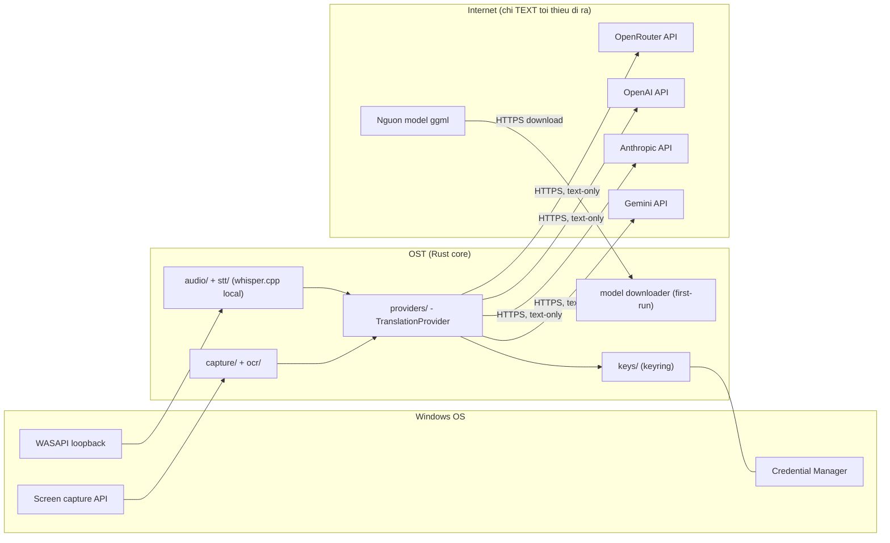

# 09 - Giao diện tích hợp {#integration}

Nguyên tắc: luồng outbound DUY NHẤT mang dữ liệu người dùng là lệnh dịch TEXT đến provider
người dùng chọn ([NFR-SEC-07](07-non-functional-requirements.md#nfr-security)). Tải model
là outbound thứ hai nhưng chỉ download, không mang dữ liệu người dùng ra ngoài.

## Bảng tích hợp

| # | Giao diện | Giao thức | Chiều | Dữ liệu | Xác thực | Ghi chú |
|---|-----------|-----------|-------|---------|----------|---------|
| I-01 | Gemini API | HTTPS REST | Ra | TEXT nguồn + prompt dịch; nhận bản dịch | API key (keychain) | Qua `TranslationProvider` trait, schema-validate response (FR-03) |
| I-02 | Anthropic API | HTTPS REST | Ra | Như I-01 | API key (keychain) | Như I-01 |
| I-03 | OpenAI API | HTTPS REST | Ra | Như I-01 | API key (keychain) | Như I-01 |
| I-04 | OpenRouter API | HTTPS REST | Ra | Như I-01 | API key (keychain) | Như I-01; định tuyến nhiều model |
| I-05 | Windows Credential Manager | keyring crate (OS API) | Hai chiều local | Giá trị API key | Phiên user Windows | Chỉ module `keys/` chạm tới (ADR-003) |
| I-06 | WASAPI loopback | Windows OS API (cpal/wasapi) | Vào | Audio buffer hệ thống | - | Sau trait `AudioSource`; audio không rời tiến trình (BR-01) |
| I-07 | Screen capture (xcap / Windows Graphics Capture) | Windows OS API | Vào | Ảnh vùng màn hình (RAM) | - | Sau trait `ScreenCapturer` |
| I-08 | OCR engine | In-process (engine CHƯA chốt) | Local | Ảnh -> text | - | [OI-01](11-assumptions-constraints.md#oi-01), TASK-005; sau trait `OcrEngine` |
| I-09 | whisper.cpp (whisper-rs) | In-process library | Local | Chunk audio -> text | - | Local hoàn toàn (ADR-002); sau trait `SpeechToText` |
| I-10 | Nguồn tải model whisper | HTTPS download | Vào | File model ggml -> `models/` | - | Chỉ khi người dùng xác nhận (BR-08); nguồn cụ thể: [AS-06](11-assumptions-constraints.md#as-06); kiểm toàn vẹn (NFR-REL-04) |

## Sơ đồ tích hợp

## Hợp đồng phía OST

- Mọi lệnh gọi LLM qua provider layer; không gọi SDK/HTTP trực tiếp từ UI, command handler
  hay pipeline stage (tech-stack.md).
- Prompt template tách chỉ thị/dữ liệu; response schema-validate; lỗi provider map thành
  domain error, không lộ key ([NFR-SEC-06, NFR-SEC-08](07-non-functional-requirements.md#nfr-security)).
- Chi tiết hợp đồng IPC + provider được duy trì trong `docs/architecture/api-contracts/`
  khi implementation bắt đầu.
